# Ordered Data Structures in C++

Notes made when following the course offered in Coursera by University of Illinois at Urbana-Champaign.
Prof. Wade Fagen-Ulmschneider. This course is 2/3 in the ['Accelerated Computer Science Fundamentals Specialization'](https://www.coursera.org/specializations/cs-fundamentals).

I have forked the orginal repository to my Github account; additionally, I use the material from the course and the original repository on this repository.

Original repository: [wadefagen/coursera](https://github.com/wadefagen/coursera).
My repository, forked from the original: [mxagar/coursera-cs400](https://github.com/mxagar/coursera-cs400).
Repository of the current notes: [mxagar/accelerated_computer_science_coursera](https://github.com/mxagar/accelerated_computer_science_coursera).

Overview of contents: 

1. Week 1: Linear Structures
   - 1.1 Arrays
   - 1.2 Lists = Linked Memory
   - 1.3 Run Time Analysis: Access, Insert
   - 1.4 Array and List Operations: Find, Insert After
   - 1.5 Queue (Data Structure)
   - 1.6 Stack (Data Structure)
   - 1.7 Week 1 Assignment: Linked Lists and Merge Sort
2. Week 2: Binary (Search) Trees
   - 2.1 Tree Terminology
   - 2.2 Binary Trees
   - 2.3 Tree Traversals
   - 2.4 Binary Search Trees (BST)
   - 2.5 BST Analysis
3. Week 3: AVL Trees and B-Trees
   - 3.1 AVL Trees
     - 3.1.1 AVL Trees: Self-Balancing BSTs
     - 3.1.2 AVL Analysis: `avl::insert()` and `avl::remove()`
   - 3.2 B-Trees
     - 3.2.1 B-Tree Introduction
     - 3.2.2 B-Tree Insert
     - 3.2.3 B-Tree Properties
     - 3.2.4 B-Tree Remove/Delete: Not considered in this course, because it is considerably more complex
     - 3.2.5 B-Tree Search
   - 3.3 Week 3 Challenge
   - 3.4 Week 3 Assignment


## Week 1: Linear Structures

### 1.1 Arrays

- An array stores data sequentially: elements are stored one after the other, increasing the memory addresses (thus, also indices) one unit at a time
- Limitations of arrays
    1. All elements of the same type
        - The size of the type is known (in bytes); that makes possible to calculate the offset to any given index. Thus, we don't need to navigate through all elements ($O(n)$), but we have direct access to each element ($O(1)$)
    2. Arrays have a fixed capacity
        - Capacity: maximum number of elements
        - Elements are stored sequentially in a memory block
        - If we exceed the capacity, we need to allocate a new larger chunk of memory and we need to copy the data over from the previous block to the new
        - However, the `std::vector` does that automatically; therefore, for the user, an `std::vector` is an array which dynamically grows in size, even though internally resizing and memory allocation happens if we exceed the initial capacity

Examples `array/ex2/main.cpp` and `array/ex3/main.cpp`:
```c++
// Create an array of 10 numbers
int values[10] = { 2, 3, 5, 7, 11, 13, 15, 17, 21, 23 };

// Print the size of each type `int`
std::cout << sizeof(int) << std::endl; // 4 (bytes)

// Compute the offset from the beginning of the array to [2]
// &[0] points to the start or index 0
// &[2] points to the start or index 2
// between indices 0 and 2 there are 2 cells -> 2 x 4 bytes
int offset = (long)&(values[2]) - (long)&(values[0]);
std::cout << offset << std::endl; // 8 = 2 x 4 bytes

// Similarly with any other structures
Cube cubes[3] = { Cube(11), Cube(42), Cube(400) };
std::cout << sizeof(Cube) << std::endl; // 8 bytes
int offset = (long)&(cubes[2]) - (long)&(cubes[0]); // 2 x 8 bytes
```

Example `array/ex4/main.cpp`: `std::vector`:
```c++
// Examine capacity, push_back = append, size
std::cout << "Initial Capacity: " << cubes.capacity() << std::endl; // 3
cubes.push_back( Cube(800) );
std::cout << "Size after adding: " << cubes.size() << std::endl; // 3
std::cout << "Capacity after adding: " << cubes.capacity() << std::endl; // 3x2 = 6, it is doubled!

// Compute the offset from the beginning of the array to [2] and [3]
std::cout << "Size of cube element: " << sizeof(cubes[0]) << std::endl; // 8 bytes
int offset1 = (long)&(cubes[2]) - (long)&(cubes[0]); // 2 x 8
int offset2 = (long)&(cubes[3]) - (long)&(cubes[0]); // 3 x 8 -> they are sequentially stored!
```

### 1.2 Lists = Linked Memory

- Linked memory lists store data elements together with a link/pointer to the location in memory of the next list node. So basically we have
    - **List nodes**: element (data) + pointer to next node
    - **Linked list** itself: set of list nodes; a head pointer (e.g., `head_`) marks the memory location where the list begins, `nullptr` marks the end of the list (the pointer to the next element of the last element is `nullptr`)

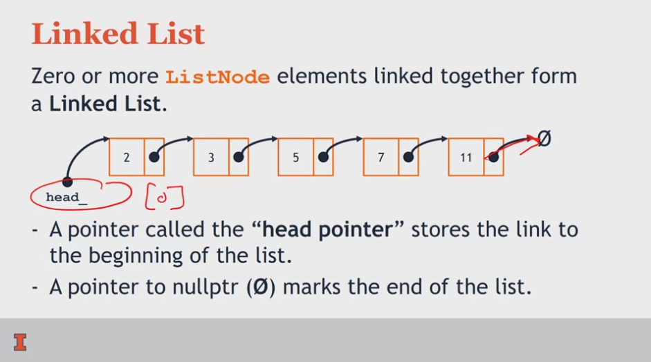

A **list node** is defined with data + pointer to the next node, as shown in `linked-memory/List.h`:
```c++
template <typename T>
class ListNode {
public:
    const T & data;
    ListNode *next;
    ListNode(const T & data) : data(data), next(nullptr) { }
};
```

A **linked list** is as shown in `linked-memory/List.h`, here simplified:
```c++
template <typename T>
class List {
  public:
    const T & operator[](unsigned index); // access elements with []
    void insertAtFront(const T & data);

  private:
    class ListNode {
      public:
        const T & data;
        ListNode *next;
        ListNode(const T & data) : data(data), next(nullptr) { }
    };

    ListNode *head_;  // head pointer    
};
```

- Differences wrt. arrays:
    - Now, if want the element in `[4]` we need to visit all previous elements before it, in chain. So here we have $O(n)$ complexity.
    - Now we can insert an element between other two elements. Usually, new elements are inserted at the front, since that requires basically creating a new node and changing the head pointer.
    - In a list, the capacity is bounded to the available (heap) memory of the system; we don't need to resize as we needed with the array
    - **Both arrays and lists contain elements of the same type**
    - Summary: lists are more flexible than arrays, but with runtime disadvantages


How to access/return a list element, as shown in `linked-memory/List.hpp`:
```c++
template <typename T>
const T & List<T>::operator[](unsigned index) {
    // We step starting in head pointer index times 
    ListNode *thru = head_;
    while (index > 0 && thru->next != nullptr) {
        thru = thru->next;
        index--;
    }  
    return thru->data;
}
```

How to insert a new list element, as shown in `linked-memory/List.hpp`:
```c++
template <typename T>
void List<T>::insertAtFront(const T & data) {
    // Create a new ListNode on the heap
    // bacause the node needs to live beyond the scope of this function
    ListNode *node = new ListNode(data);
    // Set the new node’s next pointer point the current
    // head of the List = the current first node
    node->next = head_;
    // Set the List’s head pointer to be the new node
    head_ = node;
}
```

### 1.3 Run Time Analysis: Access, Insert

- Run time analysis compare speed of an algorithm as the size of the data grows
    - Big-O notation: the most dominant term when counting the number of operations
- Access of elements in arrays and lists
    - Arrays: access to index `i`
        - `offset = sizeof(element) x i`
        - $O(1)$: one operation, no matter the size; that is called constant time
    - Lists: access to index `i`
        - We need to traverse `i` one by one
        - $O(n)$: n operations; that is called linear time
- Resizing of arrays (if capacity = size, ie., array full)
    - Everytime we exceed capacity, we need to allocate a new memory block and copy all the data there
    - If we keep on extending the array later in time, we're going to copy the data several times!
    - Strategy 1: we append the initial the capacity `c` is exceeded (eg., `c = 2`)
        - The number of copies required is quadratic (= polynomial) in the number of elements: $O(n^2)$
        - First time `r = 1`, we copy `c = 2 = r`
        - Then `r = 2`, we copy `2c = r*c`
        - Then `r = 3`, `3c = r*c`
        - If `r = n/2`, being `n` the final total number of elements
        - The total number of copies is `sum(c, 2c, ...) = c*sum(1, 2, ..., r) = c*r(r+1)/2 = r^r + r`
        - Since `r = n/2` -> $O(n^2)$ !!
    - Strategy 2: we double the size/capacity when we hit the limit
        - The number of copies required is linear in the number of elements: $O(n)$
        - First time we do `c = 2` copies, then `2c`, `2*2c`, `2*2*2c`, ...
        - Total copies = `sum(2, 4, 6, ..., 2^r) = 2(2^r - 1)`
        - We know: `c^r = n` -> `r = log2(n)`
        - Therefore: `2(2^log2(n) - 1) = 2(n-1)` -> $O(n)$ < $O(n^2)$ !!
        - **Thus, doubling the capacity every time we hit the limit leads to a linear effort of copies**
        - However, the average insertion time is $O(1)$, because 
            - We very rarely copy the entire array when inserting a new element
            - For every copying effort of $O(n)$ we have inserted `n` elements without copy
            - Therefore, the average insertion effort is $O(n)/n = O(1)*$ !!
            - That is called **amortized running time**
        
### 1.4 Array and List Operations: Find, Insert After

- Summary of complexities so far
    - **Access** index `i`
        - Array: $O(1)$: direct access via offset
        - List: $O(n)$: must traverse all nodes until `i`
    - **Insert** at the front/back
        - Array: $O(n)$ (if copy due to capacity exceeded), $O(1)*$ (amortized)
        - List: $O(1)$: new node at the head
- What about **finding** data?
    - In both, in the data is *unsorted*, we need to traverse all elements until finding the one: $O(n)$
    - However, we can improve that for the arrays if the data is *sorted*
        - Say we want to find the cube with length 17
        - We start in the middle of the container
        - Has the element a larger length? If so, we continue in the first part, otherwise in the second
        - This way, we check only half of the branch each time: `log2(n)` checks performed: $O(log2(n))$
        - This is called **binary serach**
    - For the lists, no binary search is possible: all lists have $O(n)$ find complexity
- Last operation: **insert/delete after**
    - Given an index `i`, insert element fater it
    - With an array we need to move all data after `i`; worst case, we need to move all `n` elements -> $O(n)$
    - With a list, we just need to change the pointer of element `i` -> $O(1)$

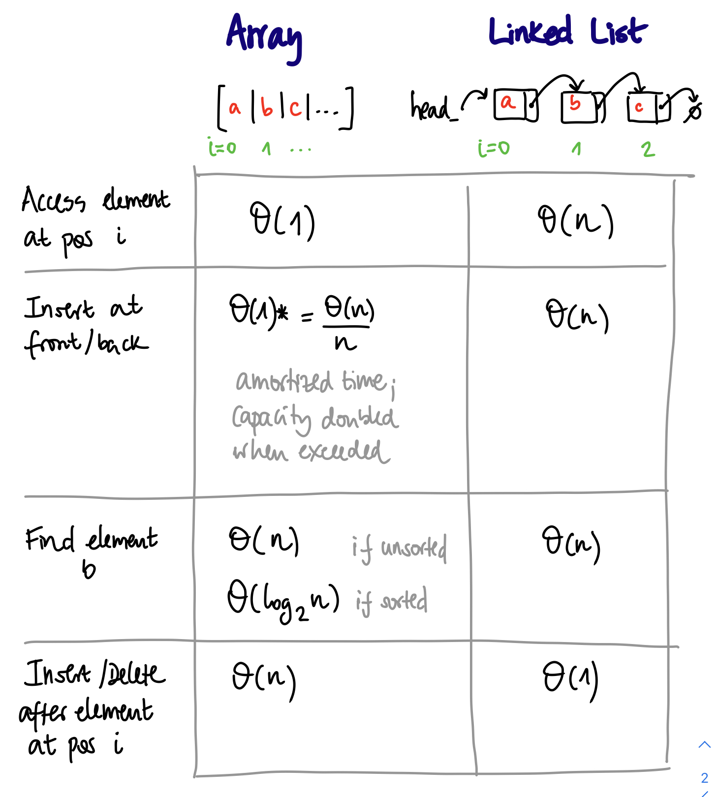

- Conclusions
    - Arrays and linked memory lists are the basis for other data structures built on top of them
    - Depending on what we want to achieve (which operations is critical), we choose the array or the list as basis
    - Similarly, we consider to sort or not

### 1.5 Queue (Data Structure)

- **FIFO** array/list: First in, First Out; it mimicks waiting in a line
- Abstract Data Type (ADT) description of a Queue, all $O(1)$:
    - `create`: create an emty queue
    - `push`: add data to the back of the queue
    - `pop`: remove data from the top of the queue
    - `empty`: return true if queue is empty
- A queue can be implemented with an undelying array or list:
    - Array implementation
        - We need to keep track of an index of where we should be removing from the queue
        - Adding elements is pushing to the array
        - The first elements of the array have the priority to be popped
            - Although we might not pop, but just modify the front index
        - All operations are $O(1)$: `create`, `push`, `pop`, `empty`
            - But: `push` and `pop` are $O(1)$ in amortized runtime, assuming capacity is doubled when exceeded
    - List implementation
        - We insert upfront at $O(1)$
        - We store a new `tail_` pointer which is pointing to the last element
        - For the queue implementation we build a doubly linked list: elements have **two pointers: the one of the next element and the one of the previous element**
        - Every time we `push`, we add before the `head_` by using the forward pointer
        - Every time we `pop`, we remove and update the `tail_` by using the backward pointer
        - All operations are $O(1)$: `create`, `push`, `pop`, `empty`

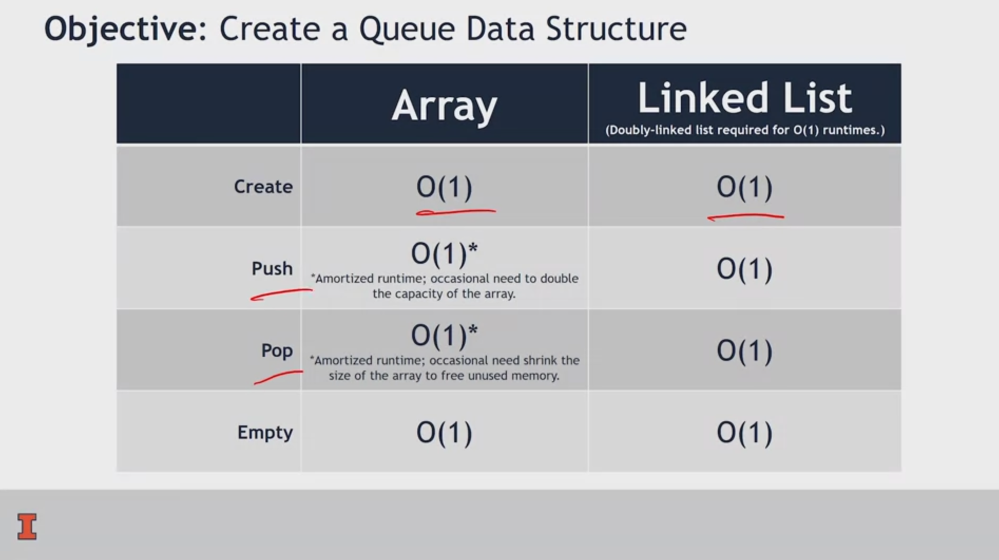

There is a `std::queue<type>` in the STL. Example from `queue/main.cpp`:
```c++
#include <queue>
...
std::queue<std::string> q;
q.push( "Orange" );
q.push( "Blue" );
q.push( "Illinois" );
// Print the front of the queue out and pop it off:
std::cout << "First pop(): " << q.front() << std::endl; // Orange
q.pop(); // Orange removed
q.push( "Illini" );
std::cout << "Second pop(): " << q.front() << std::endl; // Blue
```

### 1.6 Stack (Data Structure)

- **LIFO** array/list: Last In First Out; it mimicks a pile of dishes/papers
- Abstract Data Type (ADT) description of a Sueue, all $O(1)$:
    - `create`: create an empty stack
    - `push`: add data to the top of the stack
    - `pop`: remove data from the top of the stack
    - `empty`: return true if stack is empty
- A stack can be built with any type of collection, array/list:
    - Array-based
        - We insert backwards from n to 0; when we arrive 0, the array is expanded
        - A counters/index is kept for the last inserted element position
        - If we pop, the element on the front (index previous to the insert counter) is removed
    - List-based: it's even easier
        - We insert at the front with `push`,
        - We remove from the frot with `pop`, and update the `head_` pointer
        - Nothing new/additional is required
    - All operations are $O(1)$: `create`, `push`, `pop`, `empty`
        - But for the array-based version, `push` and `pop` are $O(1)$ in amortized runtime, assuming capacity is doubled when exceeded

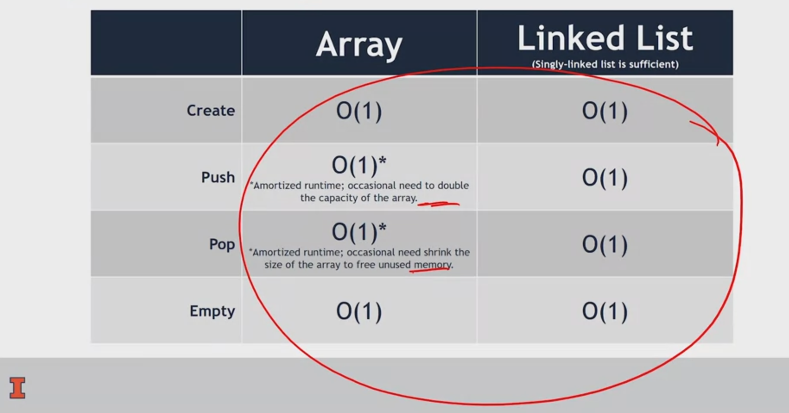

There is a `std::stack<type>` in the STL. Example from `stack/main.cpp`:
```c++
#include <stack>
...
std::stack<std::string> s;
s.push( "Orange" );
s.push( "Blue" );
s.push( "Illinois" );
// Print the front of the stack out and pop it off:
std::cout << "First pop(): " << s.top() << std::endl; // Illinois
s.pop(); // Illinois removed
s.push( "Illini" );
std::cout << "Second pop(): " << s.top() << std::endl; // Illini
```

### 1.7 Week 1 Assignment: Linked Lists and Merge Sort

See `week_1_assignment/README.md`.

#### `const` correctness

**Very important topic.**
See also this **very useful link**: [Const-Correctness](https://isocpp.org/wiki/faq/const-correctness).

```c++
// if a function name is continued by const
// it implies no data is changed within it
bool LinkedList<T>::empty() const { return !head_; }

// here, we deliver a link/reference to an internal value
// note that we deliver the link to the internal variable and we can change it!
T& LinkedList<T>::front() { return head_->data; }

// here, we pass a link/reference to a function
// with const, we force it to remain unchanged
void function(const T& data);
// without const, we could change data inside
void function(T& data);

// in case we want to pass to another function a LinkedList as const reference: const LinkedList<T>& myList
// we need to overload LinkedList's (public) member functions
// with a const function + const return version
const T& LinkedList<T>::front() const { return head_->data; }

// Always use const after the function name if it does not change anything!
```

Some notes after going through the [Const-Correctness](https://isocpp.org/wiki/faq/const-correctness) link:

```c++
// General tip: read your pointer declarations right-to-left

// p points to an X that is const:
// the X object can’t be changed via p
// ... but the content of p could be changed via another pointer
// defined pointing to the same address and defined without const!
const X* p;
// p is a const pointer to an X that is non-const:
// you can’t change the pointer p itself,
// but you can change the X object via p
X* const p;
// p is a const pointer to an X that is const:
// you can’t change the pointer p itself,
// nor can you change the X object via p
const X* const p;

// x aliases an X object,
// but you can’t change that X object via x;
// x is a reference to an X that is const
const X& x;

X const& x; // == const X& x;
X const* x; // == const X* x;


// Const member functions
class Fred {
public:
  void inspect() const;   // Const member function: promises NOT to change *this
  void mutate();          // This member function might change *this
};
void userCode(Fred& changeable, const Fred& unchangeable)
{
  changeable.inspect();   // Okay: doesn't change a changeable object
  changeable.mutate();    // Okay: changes a changeable object
  unchangeable.inspect(); // Okay: doesn't change an unchangeable object
  unchangeable.mutate();  // ERROR: attempt to change unchangeable object
}

// Return by const reference
class Person {
public:
  const std::string& name_good() const;  // Right: caller can't change the Person's name
  std::string& name_evil() const;        // Wrong: caller can change the Person's name
  int age() const;                       // Right: caller can't change the Person's age
};

void myCode(const Person& p)  // myCode() promises not to change the Person object...
{
  // Often catched by compiler as ERROR
  p.name_evil() = "Igor";     // But myCode() changed it anyway!!
}

// Const overloading if often necessary,
// especially with subscript (access/modify) operators!
// Example: we often pass an object as const& and access data within it
// but we also modify its data in other parts where it is not const&
// with the same operator []
class Fred { /*...*/ };
class MyFredList {
public:
  const Fred& operator[] (unsigned index) const;
  Fred&       operator[] (unsigned index);
  // ...
};
```


#### Insertion and Merge Sort

Insertion Sort: `O(n^2)`

```pseudocode
a <- {a0, a1, a2, ...} // a[0] == a0
i <- 1
while i < length(a)
    x <- a[i]
    j <- i - 1
    while j >= 0 and a[j] > x
        a[j+1] <- a[j]
        j <- j - 1
    end
    a[j+1] <- x
    i <- i + 1
end
```

[Merge Sort](https://en.wikipedia.org/wiki/Merge_sort), `O(n*log(n))`: efficient sorting algorithm, from Wikipedia:

1. Divide the unsorted list into n sublists, each containing one element (a list of one element is considered sorted).
2. Repeatedly merge sublists to produce new sorted sublists until there is only one sublist remaining. This will be the sorted list.

## Week 2: Binary (Search) Trees

Until now we have studied flat data structures consisting of lists or sequences of elements.
In contrast, hierarchical data structures like trees allow having elements with relationships to each other.

### 2.1 Tree Terminology

- Elements are **nodes** (often depicted as circles); the **root node** is the first node
- Nodes are connected by **edges**: arrows that connect parant nodes with children nodes
    - The root node has no parents (ie., incomming edges)
- Nodes that have no children are called **leaf nodes**; they could be at any level
- Nodes contain often the data
- Edges are often not labelled and contain no data
- Ancestry terms apply to trees: siblings, ancestors, grandchildren, grandparent
- **Three conditions** must be true for a tree: **rooted, directed and acyclic**
    - Must have a root
    - Must have directed edges
    - Must not have a cycle

### 2.2 Binary Trees

A binary tree is a tree where **every node has at most two children**. One child is the **left child** and the other is the **right child**.

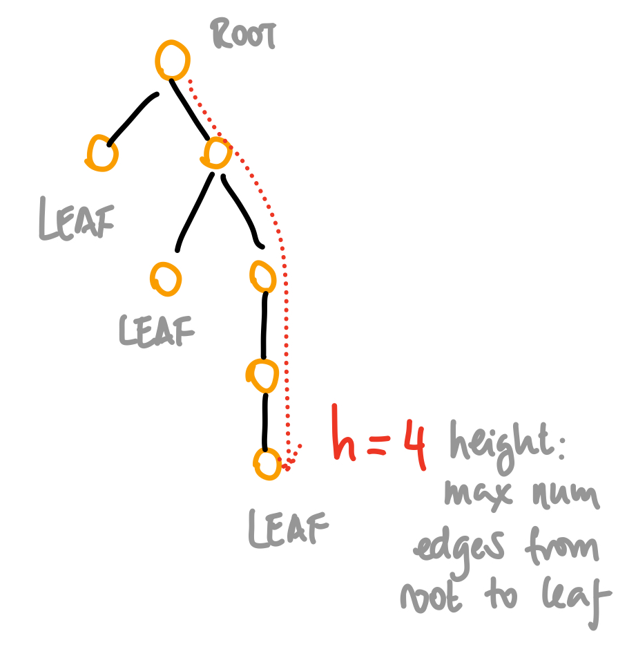

Properties of a binary tree:

- **Height** (`h`) of a binary tree: **number of edges** in the *longest path from the root to the leaf*
- A binary tree is **full** iff every node has either zero or two children.
- A binary tree is **perfect** iff all interior nodes have two children and all leaves are at the same level.
- A binary tree is **complete** iff the tree is perfect until the last level (before the leaves) and all leaf nodes on the last level are pushed to the left; that means that there could be missing some leaves on the right until a node from which we have leafs to the left. Note that complete trees are not necessarily full, or vice-versa.

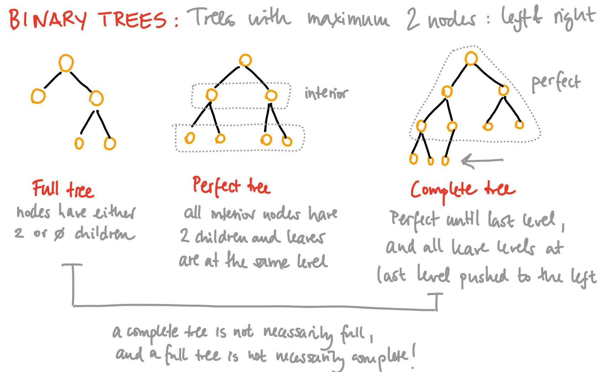


Definition of a binary tree in `binary-tree/BinaryTree.h`:
```c++
template <typename T>
class BinaryTree {
  public:
    // ...
  private:
    class TreeNode {
      public:
        T & data;
        TreeNode* left;
        TreeNode* right;
        TreeNode(T & data) : data(data), left(nullptr), right(nullptr) { }
    };
    TreeNode *root_;
};
```

### 2.3 Tree Traversals

A traversal consists in visiting all the nodes of the tree and accessing their values.
It is different to a search: the search does not have to visit all nodes, just the necessary ones until the sought one is found.
A tree traversal can be done in many ways, depending what we'd like to prioritize.
In general, we want to have different ways in which the data in the nodes is accessed, aka. shouted.

Basically, in a binary tree traversal, we can do three operations in a node:
- L: go left
- R: go right
- S: shout or access the node's data

Given those basic operations, we can define four basic traversals for BTs:
- `preOrder`: depth first, shouting/displaying current node first, then the children
- `inOrder`: depth first, shouting/displaying current node between the children. Effect: **Items are displayed in order.**
- `postOrder`: depth first, shouting/displaying current node last, after the children
- `levelOrder`: breadth first, each level completely one after the other: first level 1, then level 2, etc.

Example: `preOrder` traversal: starting with the root node, traverse all nodes by
1. shouting (displaying or accessing/using) the value of the **current** node and the
2. shouting the one on the **left** and
3. shouting the one on the **right**.

```c++
// preOrder traversal: shout current, go left, go right
template<class T>
void BinaryTree<T> preOrder(TreeNode* current) {
    if (current != nullptr) {
        shout(current); // shout = display node's stored value
        preOrder(current->left); // recursive call
        preOrder(current->right);
    }
}
```

Example: `inOrder` traversal: go left, shout current, go right. In the videos, an algebraic equation is decomposed in variables and operations and stored in a binary tree. With `inOrder` traversal, the equation is shouted in order!
```c++
// inOrder traversal: go left, shout current, go right
template<class T>
void BinaryTree<T> inOrder(TreeNode* current) {
    if (current != nullptr) {
        inOrder(current->left); // recursive call
        shout(current); // shout = display node's stored value
        inOrder(current->right);
    }
}
```

Example: `postOrder` traversal: go left, go right, shout current:
```c++
// postOrder traversal: go left, go right, shout current
template<class T>
void BinaryTree<T> postOrder(TreeNode* current) {
    if (current != nullptr) {
        inOrder(current->left); // recursive call
        inOrder(current->right);
        shout(current); // shout = display node's stored value
    }
}
```

### 2.4 Binary Search Trees (BST)

A Binary Search Tree (BST) is an ordered binary tree capable of being used as a search structure. A binary tree is a BST if for every node in the tree:

- nodes in the **left** are **less** than itself
- nodes in the **right** are **greater** than itself

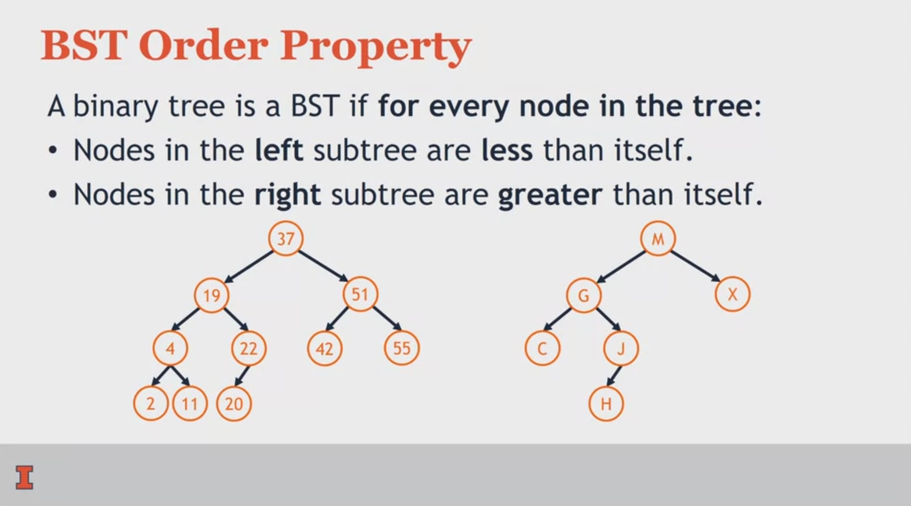

In the picture, for any node, ALL the nodes on their left must contain smaller values than what they contain.

We have seen that nodes contain data. In a BST, we usually have to types of data in each node:
- a `key` which is used to search, and to which we apply the ordering principle above (left < right)
- and a `value` or `data` associated to that `key`, which is the ultimate information we are looking for.

Indeed, if we apply recursively this ordering principle, we can store data that can be searched very quickly, for instance a `Dictionary` which associates `keys` with `values`:

- email/username: profile
- phone number: record
- url: webpage
- address: home

As said, the nodes contain the `key` values as well as a pointer to the `value` or `data`; but we omit the `value` for our purposes.

Note that the `keys` should be unique identifiers.

`Dictionary` Abstract Data Type (ADT):

- `find()`: given a `key`, find and return its `value`
- `insert()`: given a `key:value` pair, insert it properly into the dictionary
- `remove()`: remove a `key` (and its `value`)
- `empty()`: is the dictionary empty?

Dictionary structure `bst/Dictionary.h`:
```c++
template <typename K, typename D>
class Dictionary {
  public:
    Dictionary() : head_(nullptr) { }
    const D& find(const K& key);
    void insert(const K& key, const D& data);
    const D& remove(const K& key);
    bool empty() const;

  private:
    class TreeNode {
      public:
        const K& key;
        const D& data;
        TreeNode* left;
        TreeNode* right;
        // Note nodes have nullptr value for left/right
        TreeNode(const K& key, const D& data)
          : key(key), data(data), left(nullptr), right(nullptr) { }
    };
    TreeNode *head_;
    ///...
}
```

Intuition of the `find()` function:

- We have a key `k` we want to find.
- We start with the root: is `k` the root, smaller, greater? Answer determines: finish, go left, go right.
- Process repeats with current node until either: we find the node or we reach a leaf without finding it.
- Worst-case: visiting the longest path, i.e., if `h` is the height: `O(h)`. Note that the very worst case for `h` is the situation in which our tree is like a linked list, i.e., we have only left/right nodes and we need to visit all of them; in that case `h` = `n` -> `O(n) = O(h)`.

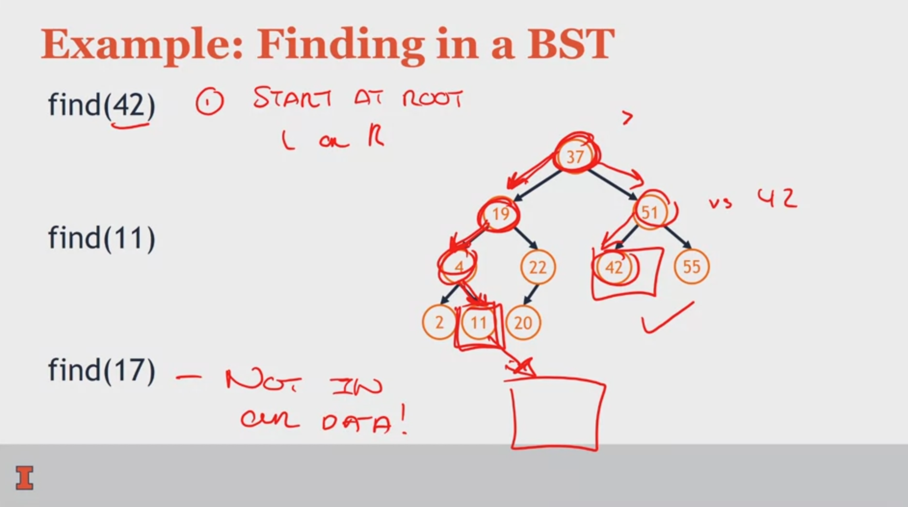

Implementation of `find()` in `bst/Dictionary.hpp`:
```c++
// Public function we call from outside
// It calls our helper function _find
template <typename K, typename D>
const D& Dictionary<K, D>::find(const K& key) {
  TreeNode*& node = _find(key, head_);
  if (node == nullptr) { throw std::runtime_error("error: key not found"); }
  return node->data;
}
...
// Helper function _find
// A node alias is returned
template <typename K, typename D>
typename Dictionary<K, D>::TreeNode*& Dictionary<K, D>::_find(const K& key, TreeNode*& cur) const {
  // In case leaf reached
  if (cur == nullptr) { return cur; }
  // If key found
  else if (key == cur->key) { return cur; }
  // Recursion left/right
  else if (key < cur->key) { return _find(key, cur->left); }
  else { return _find(key, cur->right); }
}
```

Intuition of the `insert()` function:

- Note that `find()` returns the pointer of the node, which can be the node that contains the `key` or the leaf node which would contain a child with the `key`
- Thus, we basically `find()` the `key` we want to insert in the tree until we find the leaf.
- We insert the `key` left or right to the detected leaf; left/right is automatically given by `find()`.

Implementation of `insert()` in `bst/Dictionary.hpp`:
```c++
template <typename K, typename D>
void Dictionary<K, D>::insert(const K& key, const D& data) {
  // _find 
  // if leaf reached, its left/right node pointer is returned
  TreeNode *& node = _find(key, head_);
  // new node is created on the heap and its pointer stored in the returned/aliased pointer 
  node = new TreeNode(key, data);
}
```

Intuition of the `remove()` function:

- We basically `find()` the `key` we want to remove in the tree until we find the node. The node can be
    1. leaf (= no children) or
    2. somewhere in a middle level with one child or
    3. with two children or the root node
- The cases (1) and (2) are straightforward: we remove the node (case 1) and re-link the nodes as in a linked list if necessary (case 2).
- The case (3) is more complicated because we need to find a best new node. **The best candidate for that is the node which has the closest `key` to the node we are removing**. That is called the **In-Order Predecessor** or IOP:
    - That IOP node is the previous node to the one we are eliminating in an in-order traversal, i.e., a traversal of nodes with ascending `keys`.
    - It turns out that **the IOP node is always the rightmost node of the nodes's left sub-tree**, so
        - We go to the left tree
        - We take always the right node until we reach our leaf
        - We swap the IOP and the node we are removing
        - We delete the new leaf as in case 1

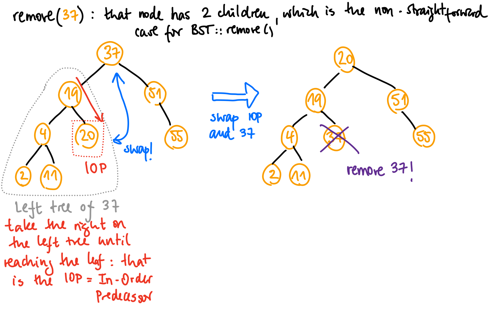

Implementation of `remove()` in `bst/Dictionary.hpp`:
```c++
// Public interface
// Note that we return the data, an alias to it??
template <typename K, typename D>
const D& Dictionary<K, D>::remove(const K& key) {
  TreeNode*& node = _find(key, head_);
  return _remove(node);
}
// Helper
template <typename K, typename D>
const D& Dictionary<K, D>::_remove(TreeNode*& node) {
  // Zero child remove
  if (node->left == nullptr && node->right == nullptr) {
    const D& data = node->data;
    delete node;
    node = nullptr;
    return data;
  }
  // One-child (left) remove
  else if (node->left != nullptr && node->right == nullptr) {
    const D& data = node->data;
    TreeNode* temp = node;
    node = node->left; // node pointer is replaced by left child's
    delete temp; // node is deleted from heap
    return data;
  }
  // One-child (right) remove
  else if (node->left == nullptr && node->right != nullptr) {
    // This case is symmetric to the previous case.
    const D& data = node->data;
    TreeNode* temp = node;
    node = node->right; // node pointer is replaced by right child's
    delete temp; // node is deleted from heap
    return data;
  }
  // Two-child remove
  else {
    TreeNode*& iop = _iop_of(node);
    TreeNode*& moved_node = _swap_nodes(node, iop);
    return _remove(moved_node);
  }
}
```

### 2.5 BST Analysis

Depending on the insertion order of the data (`keys`), the BST that contains the same data can take very different shapes. For instance, consider for the values `{1, 2, 3, 4, 5, 6, 7}`:

- Insert order 1: `4, 2, 3, 6, 7, 1, 5`. It produces a balanced tree (ie., left and right branches have a similar size), because we start with 4.
- Insert order 2: `1, 3, 2, 4, 5, 7, 6`. Since we start with 1 (smallest value), everything will be on the right. This is a bad case, because the BST resembles a linked list in which we need to traverse almost all nodes down to the leaf level to find the deepest node; i.e., `O(n)`.

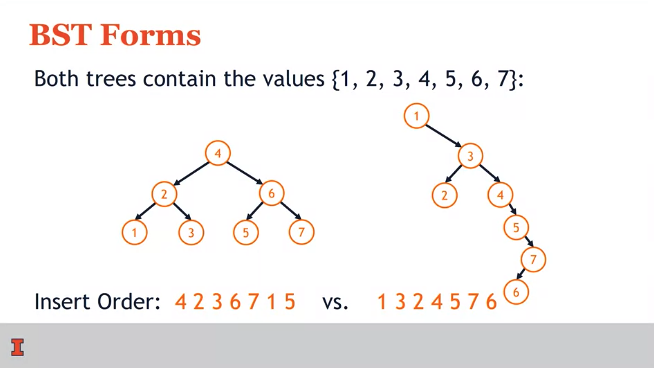

Performance considerations:

- How many possible ways can we insert the same data into a BST? $n!$. In our example with 7 elements, we have 7 options to choose for the first insertion, then 6 for the second, 5... So factorial of the number of elements.
- We want to avoid BST structures that resemble a linked list; instead we want to have balanced BSTs, ie., trees that have left and right branches similar in size (recursively).
- An **average balanced BST outforforms** any of these data structures for `find()`, `insert()` and `remove()` operations combined, bacause it requires `O(log(n))` for all of these operations:
    - Sorted list: `find(): O(n)`, `insert(): O(n)`, `remove(): O(n)`
    - Sorted array: `find(): O(log(n))`, `insert(): O(n)`, `remove(): O(n)`
    - BST worst case (which mimics a linked list): `find(): O(n)`, `insert(): O(n)`, `remove(): O(n)`

Therefore, we want to find out how to assure that average balanced BST.

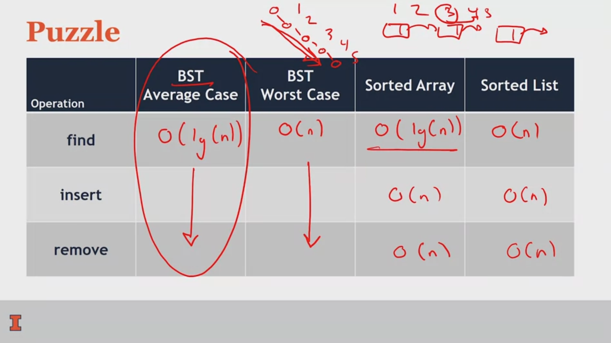

We define the **height balance factor**: the difference in height between its two left and right subtrees:

`b = height(T_r) - height(T_l)`

- `b = 0`, BST is perfectly balanced
- `b > 0`, the higher, the more imbalanced to the right
- `b < 0`, the bigger the negative, the more imbalanced to the left

Note that the height of a node with no children is `h = -1`; each level of children given a height unit to a node.

**A tree is considered balanced if `b in {0,-1,1}`. For that, all its sub-trees need to have a `b in {0,-1,1}` recursively**. Usually, we start from the leaf level and go upwards to see where the imbalance starts happening (i.e., `abs(b) > 1`); once we find and imbalance, it propagates upwards.

In the following image, the `b` height balance factor is computed for each node of the two trees:

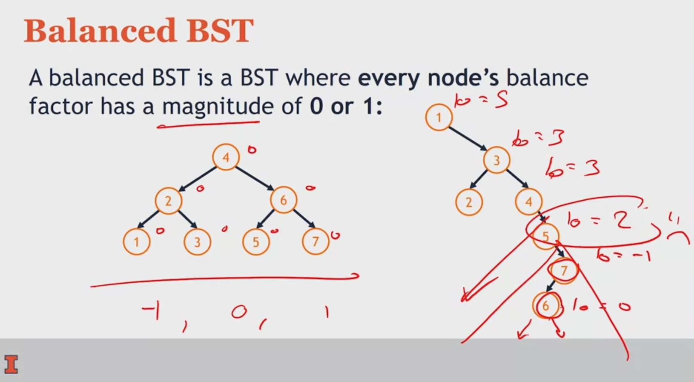

There are algorithms that maintain the balance of a BST!

## 3. Week 3: AVL Trees and B-Trees

### 3.1 AVL Trees

#### 3.1.1 AVL Trees: Self-Balancing BSTs

AVL stands for Adelson-Velsky and Landis.
An [AVL tree](https://en.wikipedia.org/wiki/AVL_tree) is a self-balancing binary search tree (BST).
The main idea consists in balancing the tree (if necessary) every time we insert or remove a node.
For that:
- The height balance factor is computed for each node
- If the magnitude of the balance factor of any node is `|b| > 1`, one of four possible rotation operations are performed; each operation type depends on the value of `b` and it balances the complete tree!
- The values of `b` and the operations are associated to characteristic topological structures in the tree: **mountain**, **stick**, **elbow**. The operations are used to convert any structure in a mountain, such that `elbow -> stick -> mountain`.

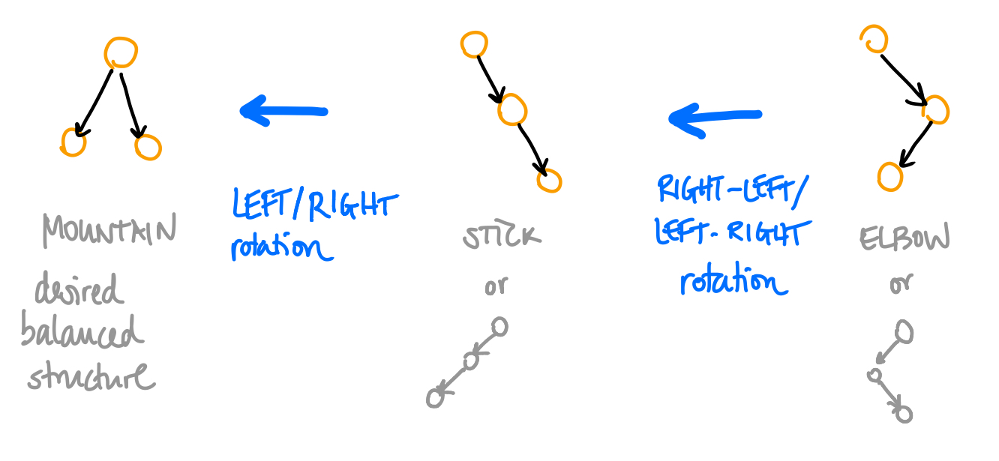

**In practice, the implementation for balancing is very easy**:
- Every time we insert a node, we compute the height balance factor `b` os all nodes
- If a node has `b = {-2,2}`, we have an imbalance
- We look at its child node, which will have `b = {-1, 1}`
- Depending on the four possible combinations of `b` values `{-2, 2}x{-1, 1}`, we perform a combination of two possible operations: **left rotation** or **right rotation**.

These combined operations achieve the transformations `elbow -> stick -> mountain`.
In the following, two subsections explain in detail the operations and the summary subsection gives the practical recipe for implementation:
- `Stick -> Mountain`: Generic Left Rotation
- `Elbow -> Stick -> Mountain`: Generic Right-Left Rotation
- **Summary & Practical Application: That, together with the pictures of the generic left and right rotations is the important part**.

##### 3.1.1.1 `Stick -> Mountain`: Generic Left Rotation

A mountain has both left and right children.
A stick is a substructure in which a node has one child and one grandchild in the same direction (left or right).

Let's consider a tree which is in balance.
We insert a node (in yellow) and it is suddenly not in balance.
To balance the tree, we do as follows:
- We compute the height balance factor `b` for all the nodes and select the one with the largest `b`: that is the **deepest node out of balance**.
- We identify the stick structure
- The middle node of the stick is pushed up and the stick becomes a mountain
  - left and right nodes with their subtrees hang from the middle node after pushing it up
  - the middle node hangs from the position where the previous higher of the three was
  - if the middle node had two children, one is attached to the left/right node which corresponds: it must have max. 1 child and node values must match

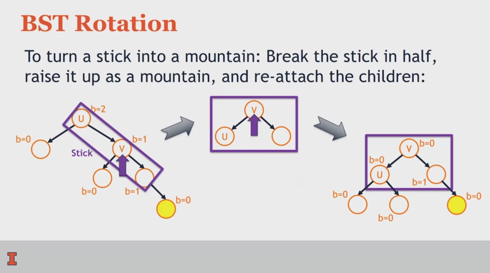

These operations on the example can be generalized as **left rotation**, summarized below.

**Generic Left Rotation**

When a tree is imbalanced to the right, a node B has `b = 2` and its right child C has `b = 1`.
In that case:
- We push node C to the place of B
- Hang B from the left of C
- Hang the left tree from C to the right from B

See pictures, everything is very clear if the second pic/slide is followed.

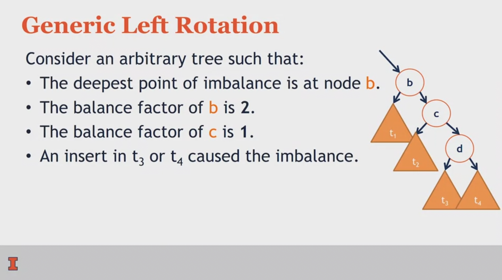

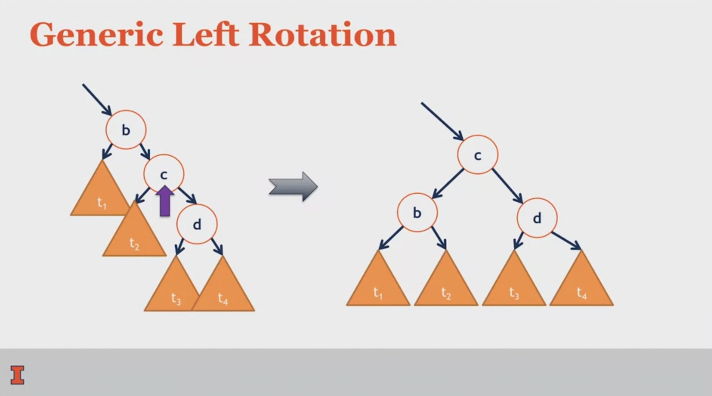

##### 3.1.1.2 `Elbow -> Stick -> Mountain`: Generic Right-Left Rotation

When an elbow is created with a new inserted node (yellow), we need to unbend it to transform it into a stick. That is achieved by pushing the new node up and the bend down as a child of the pushed node. Then, the stick is converted into a mountain! The operations are called **right-left rotation**.

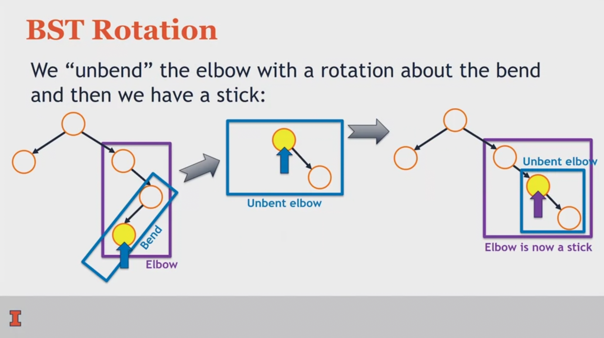

**Generic Right-Left Rotation**

The generic right-left rotation generalizes how to balance a tree with an elbow.
See pictures, everything is very clear if the second pic/slide is followed.

Note that first a **right rotation** is done (`elbow -> stick`) and then a **left rotation** (`stick -> mountain`).

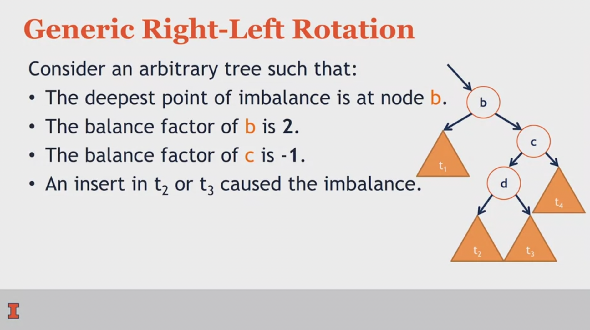

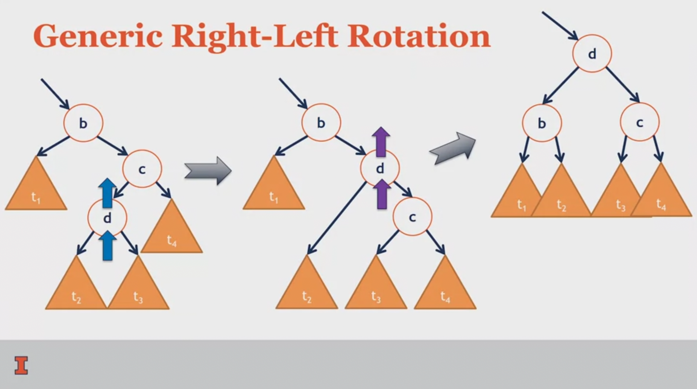

##### 3.1.1.3 Summary & Practical Application

In summary, we have two structures (sticks & elbows) and they can appear slanted in two directions (left & right). To correct them and balance the tree, a combination of two operations is used: left rotation and right rotation.

A very easy way to detect the structure type (stick/elbow slanted left/right) and the combination of operations required is identifying the key height balance factors: the `b` of the node with `|b| = 2` and the `b` of its child in the direction of the imbalance (`b = 2`: right direction imbalance, `b = -2`: left direction imbalance). The following table summarizes the algorithm to follow after the `b` values of the two nodes have been identified.

Note that
- sticks require one operation only and they have consecutive `b` values of the same sign (in the imbalance direction)
- elbows require two operations and they have consecutive `b` values of the different sign (in the imbalance direction)

Also, some important properties of AVL trees:
- Rotations are local operations performed in the 2-3 nodes that form the imbalanced structure. We basically re-arrange a few pointer addresses :)
- Rotations do not impact the broader tree
- Rotations can be performed in `O(1)`, because they are independent from the number of nodes.

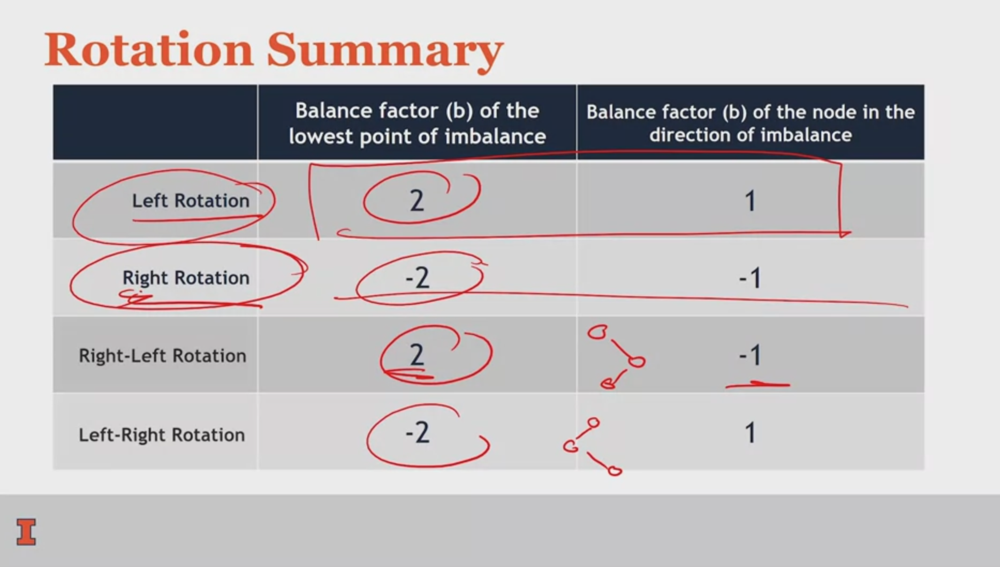

Another intuitive graphical way to understand it:

- `b = 2, 1`: right stick -> apply left rotation
- `b = -2, -1`: left stick -> apply right rotation
- `b = 2, -1`: right elbow -> apply right rotation, then left rotation
- `b = -2, 1`: left elbow -> apply left rotation, then right rotation

#### 3.1.2 AVL Analysis: `avl::insert()` and `avl::remove()`

AVL trees are self-balanced BSTs. They are kept in balance every time we insert a new node or remove an existing one. The algorithm for that is in the previous section. Basically, the height `h` of the nodes is tracked to compute the height balance factor `b` whenever an insertion/remove is performed. Then, when a node has `|b| = 2`, a combination of two rotation operations is carried out, depending on the `b` value of the child of the node with `|b| = 2`.

Therefore, an AVL tree is basically a BST, but with two additional properties:
- We keep track of the height value `h` of each node to be able to compute the height balance factor `b` easily
- We do the extra task of balancing every time we insert/remove a node

#### 3.1.2.1 `avl::insert()`

The following images show the process of performing `avl::insert()` with an example; sour steps need to be carried out:

1. Insert at proper place following the path
2. Check for imbalance along the path
3. If there is an imbalance, apply the proper rotation
4. Update the height along the path

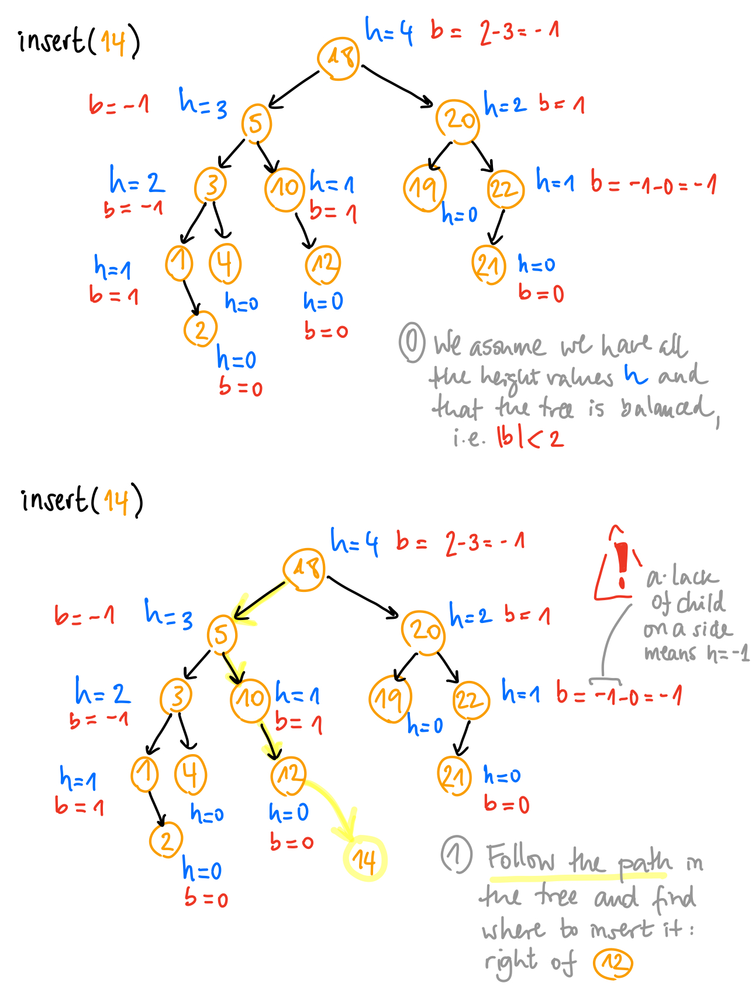

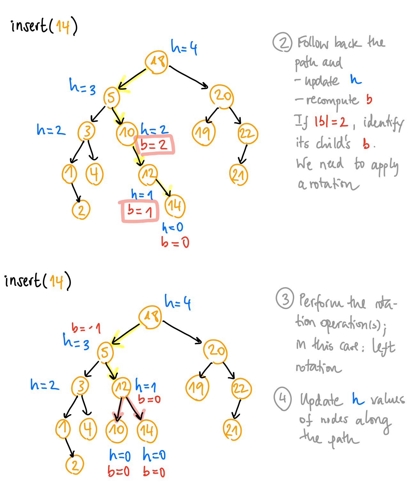

A simplified version (without checks) of the basic functions to perform a balanced insertion from `./avl/AVL.hpp`:

```c++

template <typename K, typename D>
void AVL<K, D>::_ensureBalance(TreeNode*& cur) {
  // Calculate the balance factor:
  const int balance = height(cur->right) - height(cur->left);
  // Check if not in balance
  if (balance == -2) {
    int l_balance = height(cur->left->right) - height(cur->left->left);
    if (l_balance == -1) _rotateRight(cur);
    else if (l_balance == 1) _rotateLeftRight(cur);
  } else if (initial_balance == 2) {
    int r_balance = height(cur->right->right) - height(cur->right->left);
    if (r_balance == 1) _rotateLeft(cur);
    else if (l_balance == -1) _rotateRightLeft(cur);
  }
  _updateHeight(cur);
}

template <typename K, typename D>
void AVL<K, D>::_updateHeight(TreeNode*& cur) {
  cur->height = 1 + std::max(height(cur->left), height(cur->right));
}

template <typename K, typename D>
void AVL<K, D>::_rotateLeft(TreeNode*& cur) {

  TreeNode* x = cur;
  TreeNode* y = cur->right;
  TreeNode* z = cur->right->left;

  x->right = z;
  y->left = x;
  cur = y;

  _updateHeight(x);
  _updateHeight(y);

}
```

#### 3.1.2.2 `avl::remove()`

Removing a similar; we need to follow these steps:
1. Find the node and track the path
2. Remove the node as explained in Section 2.4:
   - Find the IOP of the node: the rightmost node of the left sub-tree
   - Swap the IOP with the node to be removed
   - Remove the swapped node
3. Update the height values `h` along the path
4. Compute the height balance factors `b` along the path
5. If `|b| > 1` anywhere, perform the necessary rotations
6. Update the height values `h` along the path

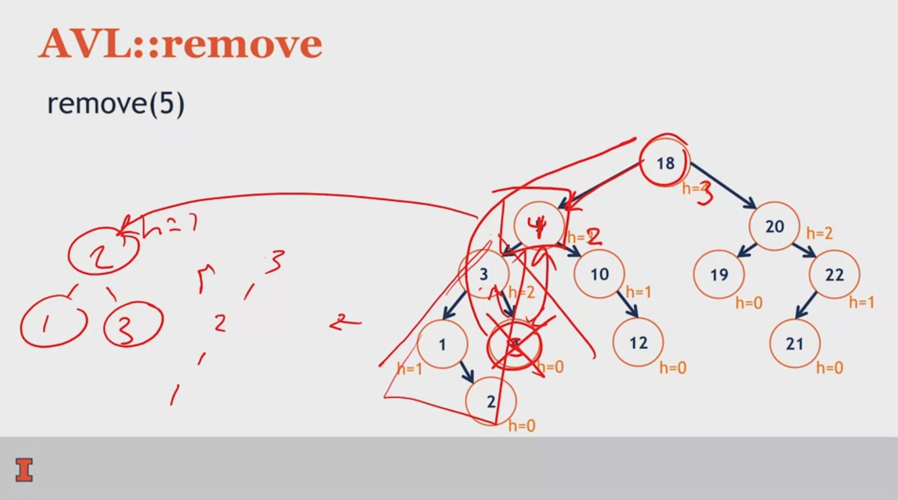

A simplified version (without checks) from `./avl/AVL.hpp` of the basic function to perform the balanced removal in the previous example:

```c++
template <typename K, typename D>
const D& AVL<K, D>::_iopRemove(TreeNode*& targetNode, TreeNode*& iopAncestor) {
  
  if (iopAncestor->right != nullptr) {
    // IOP not found, go deeper
    const D& d = _iopRemove(targetNode, iopAncestor->right);
    if (iopAncestor) _ensureBalance(iopAncestor);
    return d;
  } else {
    // Found IOP: swap locations
    TreeNode*& movedTarget = _swap_nodes(targetNode, iopAncestor); // movedTarget is in the IOP
    // Remove swapped node, now in IOP position
    const D& d = _remove(movedTarget);
    return d;
  }
}
```

A fully implemented AVL tree is in `./avl`; we can try it running `./avl/avl` after compiling `./avl/main.cpp`.

### 3.2 B-Trees

#### 3.2.1 B-Tree Introduction

The Big `O()` notation measures runtime performance considering memory allocation and access is uniform. However, data intensive applications cannot make that assumption -- these are applications that cannot store in main (RAM) memory all the data, having some on disk or somewhere else (e.g., on the cloud).

The goal of B-Tree is to have a data structure with which we can perform well with data on memory or on disk; specifically, the goal is to minimize disk/network seeks.

It is built as follows:
- Each node in the B-Tree has a number of keys, each with any value, e.g., integers: `[1, 100, 250, 400, 900, 1600]`. Note that ordering between the keys must be possible, as they are inserted in order.
- We define the **order** `m` of a B-Tree as **the maximum number of keys of each can have node + 1**; above `m = 6 + 1 = 7`. We can have less than `m - 1` keys, but never more!
- Between the keys we have pointers that point to another node with keys between the keys around the pointer. After the key `100` we will have a pointer pointing to a node with keys between `100` and `250`. The first and last keys in a node can have also a pointer before and after, pointing to nodes with keys previous and posterior to them

#### 3.2.2 B-Tree Insert

Insertion of a new key into a node works as follows:
- First we find in the tree in which node the key should go.
- We add the key to the node we found: if the number of keys exceeds is `=< m-1`, we're done. Otherwise, we will exceed the node in one key (i.e., we have `m` keys). In that case:
  - We split the node in 2 halves and the middle key in between.
  - We need to push up (throw up) the middle key to the parent node.
- Then, the process repeats recursively upwards. At some point, we might need to create a new node, even with a single key.

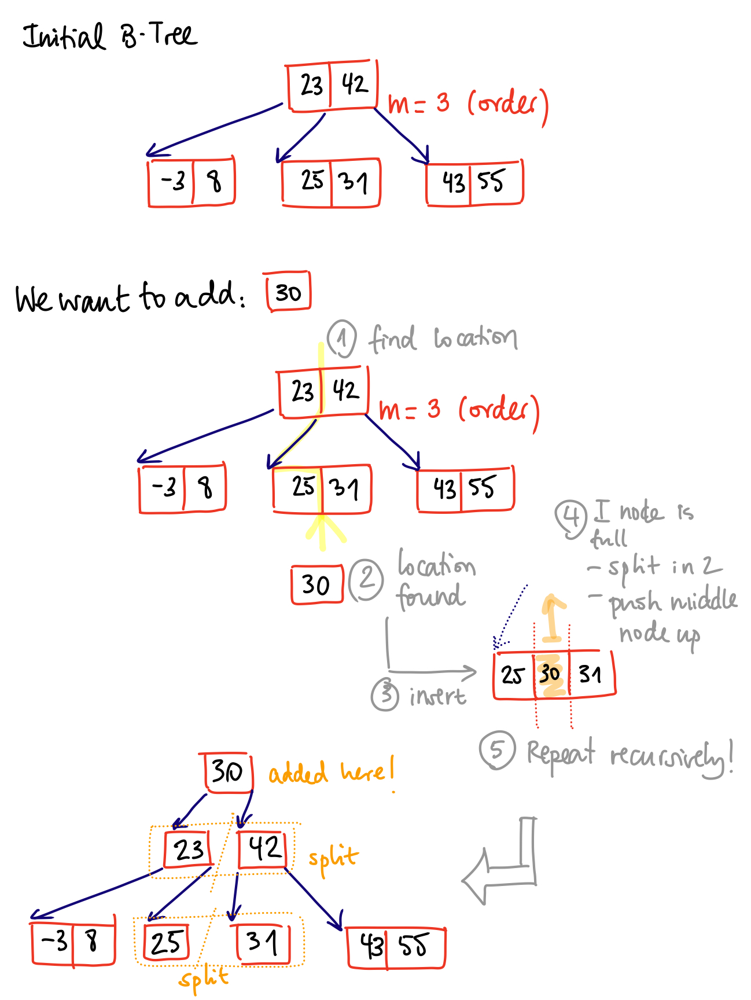

#### 3.2.3 B-Tree Properties

- A B-Tree has an order `m`
- Each node can have a maximum of `m - 1` keys
- Keys are always sorted
- Each internal node has one more children pointers than keys: that is because we have pointers before, after and between the keys
  - Thus, each node has at most `m` children
  - A root node can be a leaf or have `[2,m]` children
  - Each non-root, internal node has `[ceil(m/2),m]` children: at least have full! That makes sense, because we split in half if full!
- All leaves are on the same level
- We build the tree upwards, by pushing the nodes up when new nodes are inserted.

With these properties, whenever we see a B-Tree we can bound or reason its order:
- Max keys `m - 1`
- Inner nodes minimum `ceil(m/2)` children pointers
- ...

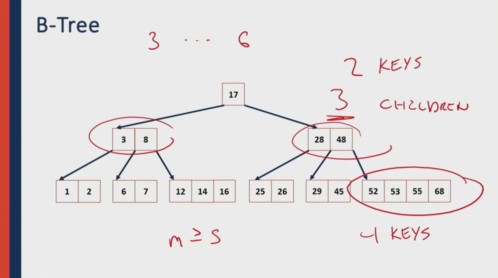

#### 3.2.4 B-Tree Remove/Delete: Not considered in this course, because it is considerably more complex

Not considered in this course, because it is considerably more complex.

#### 3.2.5 B-Tree Search

During the search of a key in the B-Tree we do as many comparisons as the height `h` of the tree.

In other words, the height of the tree determines the number of seeks possible during search.
Recall that seeks are the operations which are time consuming, since they access the disk/network.

Below, an example in provided for the function `BTree::_exists()`, which calls `Node::_fetchChild(i)`, the seeking function we'd like to avoid.

`./btree/BTree.h`:

```c++
// We pass a node of a B-Tree and a key
// We want to find out whether that key exists in the tree
template <typename K>
bool BTree<K>::_exists(BTree<K>::BTreeNode & node, const K & key) {
  unsigned i;
  // We visit the keys in the passed node
  // until we find the key which is larger than the key to find
  // for stops with i pointer value
  // Note that we could do a binary search (O(log(n))) instead of this linear search (O(n))
  // BUT: this search time is insignificant
  // what really is time consuming is _fetchChild below!!
  // Reason: it fetches data from disk/network/cloud!
  for ( i = 0; i < node.keys_ct_ && key < node.keys_[i]; i++) { }

  // Key found: we're done - found!
  if ( i < node.keys_ct_ && key == node.keys_[i] ) {
    return true;
  }

  // If node is leaf and key was not found: we're done -- not found!
  if ( node.isLeaf() ) {
    return false;
  } else {
    // We have not found the key yet, but
    // - we are not leaf
    // - we have the pointer to go deeper in the tree
    // So: we fetch the child of the pointer
    // and recursively call this function again!
    // Note: _fetchChild is the most time consuming part we want to prevent
    // because it fetches data from disk/network/cloud!
    BTreeNode nextChild = node._fetchChild(i);
    return _exists(nextChild, key);
  } 
}
```

Important properties:
- The height `h` of the structure is `log_m(n)`
- The number of seeks (calls to `fetchChild()`) is no more than `h = log_m(n)`. Or: `m^h = n`.

Example:

- `n = 1,000,000,000,000 = 10^12` keys in total
- order `m = 1001` 
- `h = log_m(n) = log(base=10^3,10^12) = 4`: we only will need to to 4 seeks with so many keys!

That's an excellent data structure for large datasets that are hybrid: part in memory, part fetched over the network or in disk.

### 3.3 Week 3 Challenge

Write the `height()` method/function that computes the height of all the subnodes of the input node.

See `./week_3_challenge` for the implementation and more information.

### 3.4 Week 3 Assignment

