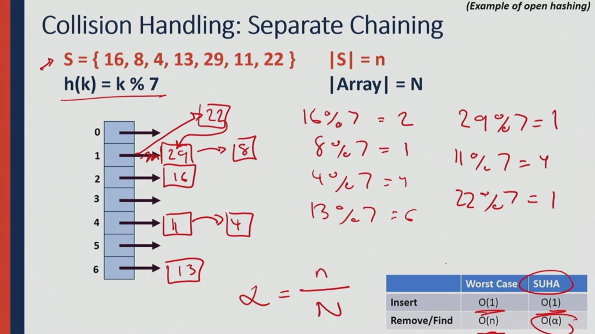
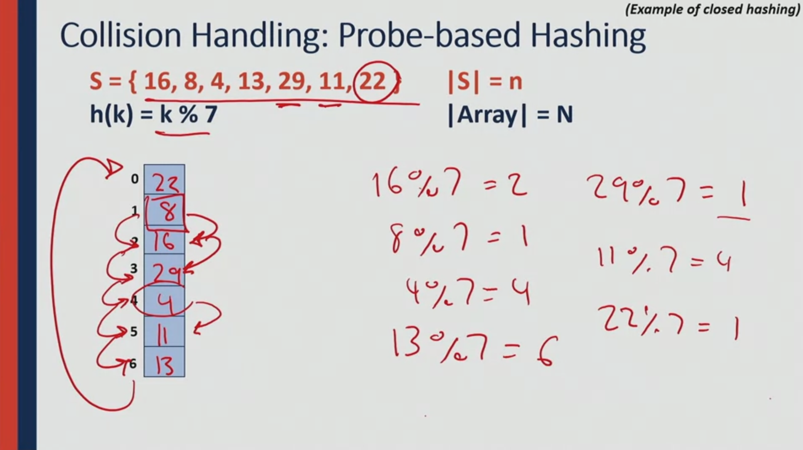

# Unordered Data Structures in C++

Notes made when following the course offered in Coursera by University of Illinois at Urbana-Champaign.
Prof. Wade Fagen-Ulmschneider. This course is 3/3 in the ['Accelerated Computer Science Fundamentals Specialization'](https://www.coursera.org/specializations/cs-fundamentals).

I have forked the orginal repository to my Github account; additionally, I use the material from the course and the original repository on this repository.

Original repository: [wadefagen/coursera](https://github.com/wadefagen/coursera).
My repository, forked from the original: [mxagar/coursera-cs400](https://github.com/mxagar/coursera-cs400).
Repository of the current notes: [mxagar/accelerated_computer_science_coursera](https://github.com/mxagar/accelerated_computer_science_coursera).

Overview of contents: 

## Week 1: Hashing

### 1.1 Introduction

Hashing allows us to create dictionary data structures, which have `key:value` pairs or mappings.
We have a key-space which is mapped to a fix-sized **hash table** with a **hash function**.
In that hash table, our data is stored: for each `array index` obtained from a hashed `key`, we have a `value` item; however, users interact with the `key`, not its hashed version.

A hash table needs to have:

- a hash function which maps the keys to array indices
- an array to store values, indexed through the hashed keys
- a collision handling strategy in case the hashing function yields non univocal mappings

Note that in each cell of the table/array, we store the key, its hash and the data/value, not only the value. That is a way of keeping track of collisions that might arise when two different keys lead to the same hash.

### 1.2 Hash Function

It is very difficult to create good hash functions, so usually already existing ones are used; but one needs to understand their properties and how to analize them.
#### Examples of Hash Functions

- On-To-Function: considering `keys` are `s` strings, map them to indices `i = s[0] -'A' = 0, 1, ...`. However, two strings starting with the same letter collide, so we need to deal with that.
- [Petals around the rose](https://en.wikipedia.org/wiki/Petals_Around_the_Rose): we throw 5 dice and count the number of "petals" or extrinsic dots of numbers that have a dot in the center ("roses": 1-3-5). Basically, we map a set of 5 numbers between 1-6 to another integer. However, odd numbers are not mapped and different sets of dice might lead to the same number of petals = collision.

#### Properties

A hash function `h()` must fulfill the following:

- It must map the key into an integer.
- The mapping must be as compressed as possible; that can be achieved with the `modulo` operator.

A **good hash function** `h()` has 3 characteristics

1. It must run in **constant time**: `O(1)`; that is essential, because we call it every time we insert/access a value associated to a key.
2. It must be **deterministic**: if we hash a key at two different times, the hashed integer must be the same.
3. It satisfies the **SUHA: Simple Uniform Hashing Assumption**: `P(h(a) = h(b)) = 1 / m`, being `m` the size of the hash table. In other words, the hash of `a` and `b != a` will be somewhere in the hash table with uniform probability (so the same probability to be anywhere).

It is recommended to use already well established hash functions; in reality, the way of knowing whether a hash function is good, is to check how long is has been used.

### 1.3 Collision Handling

When two different input keys have the same hash, we have a collision.

In the following, we discuss two approaches to deal with hashing collisions:

1. Separate chaining: basically, having liked lists in the hash table cells
2. Probing and double hashing

#### 1.3.1 Separate Chaining

One way of dealing with collisions is **Separate Chaining**.
With it, we basically define a linked list for each of the items or cells in the hash table.
Every time there is a collision, we insert a new `key:value` with the colliding hash index to the **front** of the linked list. Since we insrt it in the front, insertion is `O(1)`: we don't look whether the list has already several items!

However, finding/removing the data in the hash table becomes

- `O(n)` in the worst case
- and `O(alpha)` if the SUHA condition is fulfilled, being `alpha = n / N` the load of the has table, i.e., how many elements `n` we have in the table over the total amount of slots `N`.

Example:

`h(k) = k % 7`
`S = {16, 8, 4, 13, 29, 11, 22}`

See image...



#### 1.3.2 Linear Probing and Double Hashing

Two other (related) methods to deal with collisions are **linear probing** and **double hashing**.

**Linear probing** consists in looking for the next free slot (circularly, if necessary) in the array/table whenever we have a collision; we start with the next cell to the hashed index and keep on. Recall that the hash table stores the key + value, and we know the hash from the index.

So for the same example hash function as before, the updated version would be:

`try h(k) = (k + i) % 7, if full`, being `i = 0, 1, ...` the trial until a free slot is found.



However, linear probing causes the creating of clusters or chunks of cells in the hash table that are filled, because we fill the next free cell in case of collision. That is not optimal, because we want a uniform distribution of hashes according to the SUHA assumption!

A solution to that is to perform **double hashing** instead of **linear probing**. Double hashing assures the uniform distribution of colliding hashes, since the new index is not necessary immediate to the colliding one:

`try h(k) = (k + i*h2(k)) % 7, if full`, being `i = 0, 1, ...` the trial until a free slot is found and `h2(k)` the second hash function, for instance `h2(k) = 5 - k % 5`.

That can be also written as (sure, I think that's incorrect?):

`h(k, i) = (h1(k) + i*h2(k)) % 7` with `h1(k) = k % 7`, `h2(k) = 5 - k % 5`.

#### 1.3.3 Load Factor and Re-Hashing

Independently of the collision handling we use, the number of trials to find/remove increases when the load factor `alpha` increases, and that is the only decisive factor; recall:

`alpha = n / N = number of hashes filled / total capacity`

Therefore, the find time does not depend on the amount of data, but on how full the hash table is! Thus, we can always expand the table and keep constant time `O(1)` for find/remove operations!

However, note that when we expand our hash table:

- We need to double its size, as learnt in the previous course, to achieve amortized `O(1)*`.
- We need to rehash all the elements again to redistribute them in the new hash table.

As a convention, `alpha <= 0.6` leads to great performance, independently of the collision handling we use.

## 1.4 Hashing Analysis

Some notes related to the performance of the hash tables and their applications

- For big records (large cell sizes), use linked lists, i.e., separate chains.
- If structure speed is the priority, use linear probing or double hashing.
- Hash tables replace BST/AVL dictionaries:
  - AVL/BST have good nearest neighbor connectivity, and they should be used when that is important: nearest neighbors or range finding. Their look-up is `O(log(n))`.
  - Hash tables do not have good neighbor connectivity, but have `O(1)` look-up times; thus, we should use them when we expect many look-ups. Nearest neighbor search is `O(n)` in a hash table.
  - In summary, if all you care is look-up, go with the hash table.

## 1.5 Hash Tables in C++

There are dictionary implementations in the C++ STL:

```c++

// Implementation of a tree-based dictionary, similar to AVL
// Thus: look-up is O(log(n))
// but we can perform fast range (neighborhood) searches
std::map
std::map::operator[]
std::map::insert()
std::map::erase()
std::map::lower_bound(key) // iterator for first element <= key
std::map::upper_bound(key) // iterator for first element > key

// Implementation of a hash table
// Thus: look-up is O(1)
// but we cannot perform range (neighborhood) searches
// Instead, we can control the load alpha
std::unordered_map
std::unordered_map::operator[]
std::unordered_map::insert()
std::unordered_map::erase()
std::unordered_map::load_factor()
std::unordered_map::max_load_factor()

```