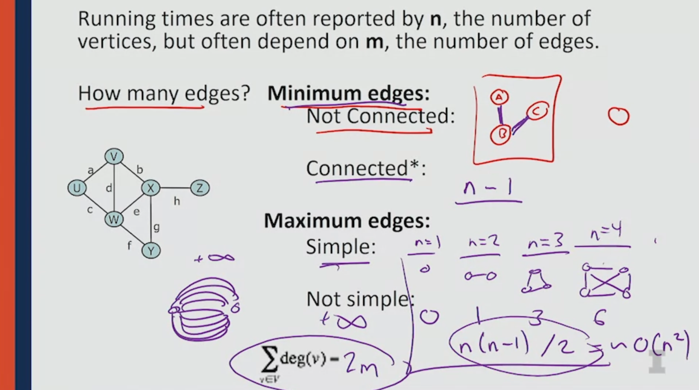
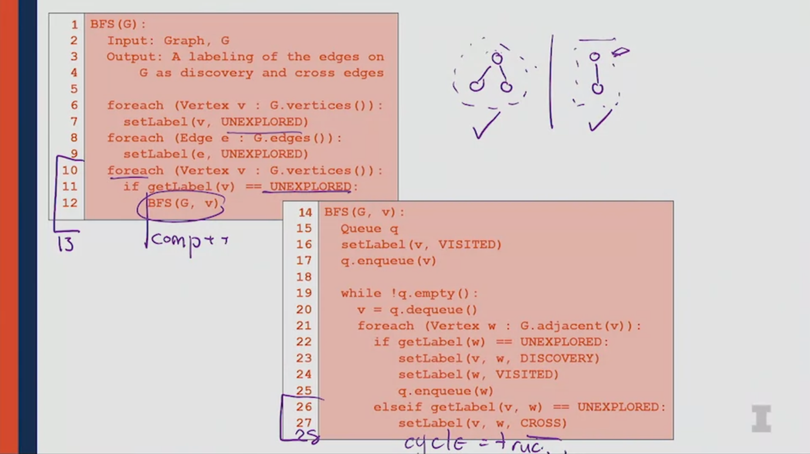
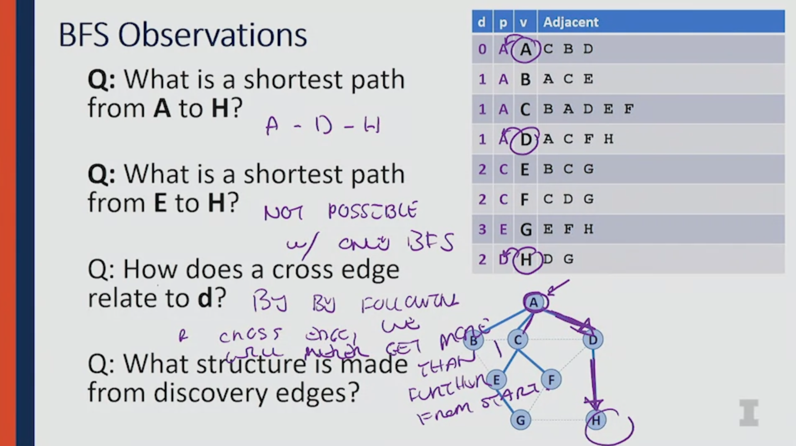
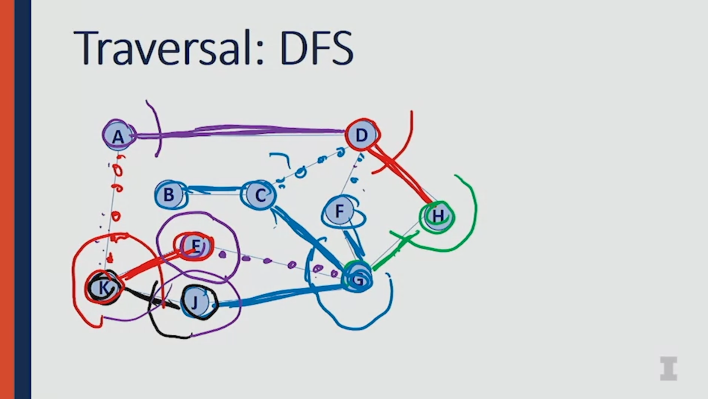
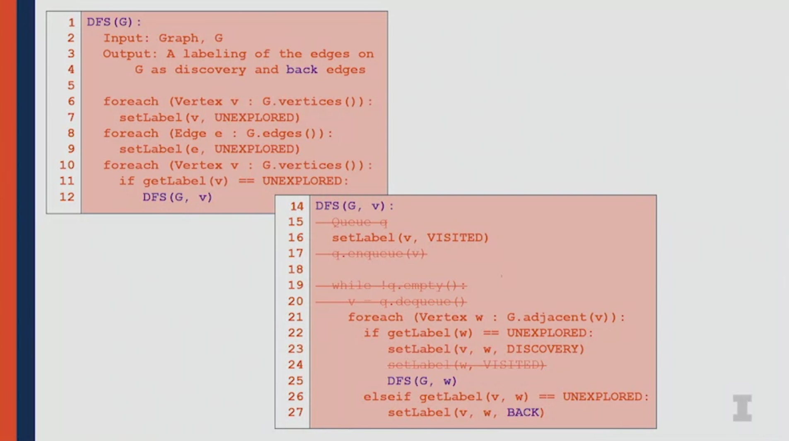
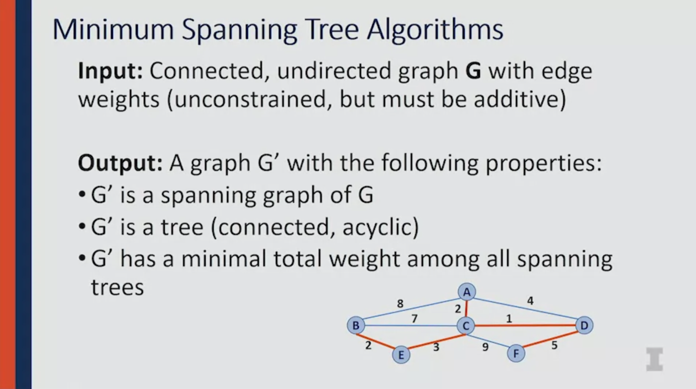
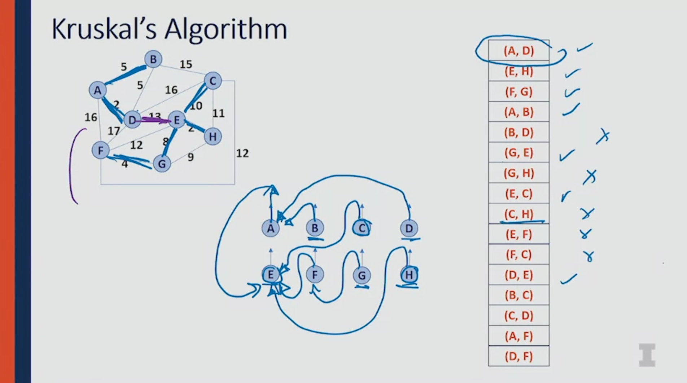

# Unordered Data Structures in C++

Notes made when following the course offered in Coursera by University of Illinois at Urbana-Champaign.
Prof. Wade Fagen-Ulmschneider. This course is 3/3 in the ['Accelerated Computer Science Fundamentals Specialization'](https://www.coursera.org/specializations/cs-fundamentals).

I have forked the orginal repository to my Github account; additionally, I use the material from the course and the original repository on this repository.

Original repository: [wadefagen/coursera](https://github.com/wadefagen/coursera).
My repository, forked from the original: [mxagar/coursera-cs400](https://github.com/mxagar/coursera-cs400).
Repository of the current notes: [mxagar/accelerated_computer_science_coursera](https://github.com/mxagar/accelerated_computer_science_coursera).

Overview of contents: 

1. Week 1: Hashing
   - 1.1 Introduction
   - 1.2 Hash Function
     - Examples of Hash Functions
     - Properties
   - 1.3 Collision Handling
     - 1.3.1 Separate Chaining
     - 1.3.2 Linear Probing and Double Hashing
     - 1.3.3 Load Factor and Re-Hashing
   - 1.4 Hashing Analysis
   - 1.5 Hash Tables in C++
   - 1.6 Week 1 Challenge: Linear Probing Inserting in a Hash Table
   - 1.7 Week 1 Assignment: `std::unordered_map`
2. Week 2: Disjoint Sets
   - 2.1 Introduction to Disjoint Sets
   - 2.2 Disjoint Sets: Implementations
     - Version 1: Naive
     - Version 2: UpTrees
     - Version 3: UpTrees with Smart Union and Path Compression
   - 2.3 Week 2 Challenge: Path Compression in an UpTree
3. Week 3: Graph Data Structures
   - 3.1 Graphs: Vocabulary & Notation
   - 3.2 Graph ADT (Abstract Data Structure)
   - 3.3 Graphs: First Implementation -- Edge-List Implementation
   - 3.4 Graphs: Second Implementation -- Adjacency Matrix Implementation
   - 3.5 Graphs: Third Implementation -- Adjacency List Implementation
   - 3.6 Graphs: Implementation Comparison
   - 3.7 Week 3 Challenge: Union of Graphs Represented as Disjoint Sets
   - 3.8 Week 3 Assignment: Breadth-First-Search in a Graph
4. Week 4: Graph Algorithms

## Week 1: Hashing

### 1.1 Introduction

Hashing allows us to create dictionary data structures, which have `key:value` pairs or mappings.
We have a key-space which is mapped to a fix-sized **hash table** with a **hash function**.
In that hash table, our data is stored: for each `array index` obtained from a hashed `key`, we have a `value` item; however, users interact with the `key`, not its hashed version.

A hash table needs to have:

- a hash function which maps the keys to array indices
- an array to store values, indexed through the hashed keys
- a collision handling strategy in case the hashing function yields non univocal mappings

Note that in each cell of the table/array, we store the key, its hash and the data/value, not only the value. That is a way of keeping track of collisions that might arise when two different keys lead to the same hash.

### 1.2 Hash Function

It is very difficult to create good hash functions, so usually already existing ones are used; but one needs to understand their properties and how to analize them.
#### Examples of Hash Functions

- On-To-Function: considering `keys` are `s` strings, map them to indices `i = s[0] -'A' = 0, 1, ...`. However, two strings starting with the same letter collide, so we need to deal with that.
- [Petals around the rose](https://en.wikipedia.org/wiki/Petals_Around_the_Rose): we throw 5 dice and count the number of "petals" or extrinsic dots of numbers that have a dot in the center ("roses": 1-3-5). Basically, we map a set of 5 numbers between 1-6 to another integer. However, odd numbers are not mapped and different sets of dice might lead to the same number of petals = collision.

#### Properties

A hash function `h()` must fulfill the following:

- It must map the key into an integer.
- The mapping must be as compressed as possible; that can be achieved with the `modulo` operator.

A **good hash function** `h()` has 3 characteristics

1. It must run in **constant time**: `O(1)`; that is essential, because we call it every time we insert/access a value associated to a key.
2. It must be **deterministic**: if we hash a key at two different times, the hashed integer must be the same.
3. It satisfies the **SUHA: Simple Uniform Hashing Assumption**: `P(h(a) = h(b)) = 1 / m`, being `m` the size of the hash table. In other words, the hash of `a` and `b != a` will be somewhere in the hash table with uniform probability (so the same probability to be anywhere).

It is recommended to use already well established hash functions; in reality, the way of knowing whether a hash function is good, is to check how long is has been used.

### 1.3 Collision Handling

When two different input keys have the same hash, we have a collision.

In the following, we discuss two approaches to deal with hashing collisions:

1. Separate chaining: basically, having liked lists in the hash table cells
2. Probing and double hashing

#### 1.3.1 Separate Chaining

One way of dealing with collisions is **Separate Chaining**.
With it, we basically define a linked list for each of the items or cells in the hash table.
Every time there is a collision, we insert a new `key:value` with the colliding hash index to the **front** of the linked list. Since we insrt it in the front, insertion is `O(1)`: we don't look whether the list has already several items!

However, finding/removing the data in the hash table becomes

- `O(n)` in the worst case
- and `O(alpha)` if the SUHA condition is fulfilled, being `alpha = n / N` the load of the has table, i.e., how many elements `n` we have in the table over the total amount of slots `N`.

Example:

`h(k) = k % 7`
`S = {16, 8, 4, 13, 29, 11, 22}`

See image...


#### 1.3.2 Linear Probing and Double Hashing

Two other (related) methods to deal with collisions are **linear probing** and **double hashing**.

**Linear probing** consists in looking for the next free slot (circularly, if necessary) in the array/table whenever we have a collision; we start with the next cell to the hashed index and keep on. Recall that the hash table stores the key + value, and we know the hash from the index.

So for the same example hash function as before, the updated version would be:

`try h(k) = (k + i) % 7, if full`, being `i = 0, 1, ...` the trial until a free slot is found.


However, linear probing causes the creating of clusters or chunks of cells in the hash table that are filled, because we fill the next free cell in case of collision. That is not optimal, because we want a uniform distribution of hashes according to the SUHA assumption!

A solution to that is to perform **double hashing** instead of **linear probing**. Double hashing assures the uniform distribution of colliding hashes, since the new index is not necessary immediate to the colliding one:

`try h(k) = (k + i*h2(k)) % 7, if full`, being `i = 0, 1, ...` the trial until a free slot is found and `h2(k)` the second hash function, for instance `h2(k) = 5 - k % 5`.

That can be also written as (sure, I think that's incorrect?):

`h(k, i) = (h1(k) + i*h2(k)) % 7` with `h1(k) = k % 7`, `h2(k) = 5 - k % 5`.

#### 1.3.3 Load Factor and Re-Hashing

Independently of the collision handling we use, the number of trials to find/remove increases when the load factor `alpha` increases, and that is the only decisive factor; recall:

`alpha = n / N = number of hashes filled / total capacity`

Therefore, the find time does not depend on the amount of data, but on how full the hash table is! Thus, we can always expand the table and keep constant time `O(1)` for find/remove operations!

However, note that when we expand our hash table:

- We need to double its size, as learnt in the previous course, to achieve amortized `O(1)*`.
- We need to rehash all the elements again to redistribute them in the new hash table.

As a convention, `alpha <= 0.6` leads to great performance, independently of the collision handling we use.

### 1.4 Hashing Analysis

Some notes related to the performance of the hash tables and their applications

- For big records (large cell sizes), use linked lists, i.e., separate chains.
- If structure speed is the priority, use linear probing or double hashing.
- Hash tables replace BST/AVL dictionaries:
  - AVL/BST have good nearest neighbor connectivity, and they should be used when that is important: nearest neighbors or range finding. Their look-up is `O(log(n))`.
  - Hash tables do not have good neighbor connectivity, but have `O(1)` look-up times; thus, we should use them when we expect many look-ups. Nearest neighbor search is `O(n)` in a hash table.
  - In summary, if all you care is look-up, go with the hash table.

### 1.5 Hash Tables in C++

There are dictionary implementations in the C++ STL:

```c++

// Implementation of a tree-based dictionary, similar to AVL
// Thus: look-up is O(log(n))
// but we can perform fast range (neighborhood) searches
std::map
std::map::operator[]
std::map::insert()
std::map::erase()
std::map::lower_bound(key) // iterator for first element <= key
std::map::upper_bound(key) // iterator for first element > key

// Implementation of a hash table
// Thus: look-up is O(1)
// but we cannot perform range (neighborhood) searches
// Instead, we can control the load alpha
std::unordered_map
std::unordered_map::operator[]
std::unordered_map::insert()
std::unordered_map::erase()
std::unordered_map::load_factor()
std::unordered_map::max_load_factor()

```

### 1.6 Week 1 Challenge: Linear Probing Inserting in a Hash Table

See `./week_1_challenge/README.md`.

### 1.7 Week 1 Assignment: `std::unordered_map`

See `./week_1_assignment/README.md`.

Many comments are written on that `README.md` related to the following topics:
- `std::unordered_map`
- `std::pair`
- "memoization"

## Week 2: Disjoint Sets

### 2.1 Introduction to Disjoint Sets

Disjoint sets are collections of elements with these two properties:

1. they have **no element in common**
2. and each set can have a number of elements, but they are **considered to be equivalent, indistinguishable**.

For working with graphs (weeks 3 & 4), we are interested in defining effective algorithm for the following operations:

- `set_id <- find(element_id)`: we want to find the `set_id` in which the element with `element_id` is located. Note that we differentiate between element `id` and set `id`;
- `set_C <- union(set_A, set_B)`: we want to join to disjoint sets to form a new one.

In fact, disjoint sets are also known as **union-find** data structures, because they are used primarily due to those important operations.

To simplify:

- We consider elements to be integers, thus, the `element_ids` are the integers themselves.
- We consider the id of a set the first integer element of the set.


In the figure example:

`set Orange := {2,5,9}; id = 2`
`set Blue := {7}; id = 2`
`set Purple := {0, 1, 4, 8}; id = 0`
`set Yellow := {3, 6}; id = 3`

From the definitions and properties:

- We know that `find(4) == find(8) == 0`.
- A disjoint set can be understood as a disjoint set of other disjoint sets, each one having a representative member.

From the implementation perspective, we have the following interfaces:

```c++
void makeSet(const T& t);
T& find(const T& k);
void setUnion(const T& k1, const T& k2) {
  if (find(k1) != find(k2)) {
    // Note union is a reserved word in C++
    union_(k1, k2);
  }
};
```

### 2.2 Disjoint Sets: Implementations

Since the elements in the sets are unique and all sets are different, we can store them in an array, as shown in the image. For cases in which we don't have integers, we can either assign integers to the elements or use a hash map instead of an array.

Recall that **the goal is to define the underlying data structure and efficient `find()` and `union()` functions**.

#### Version 1: Naive

In the array, the index/key is the `element_id` and the cell content is the `set_id`.


That version yields:
- `find(k)` is `O(1)` (great), because the item is the array index, which returns the set id.
- `union(k1,k2)` is `O(n)`, because we need to visit all the elements in the cell to make sure that the elements from set `k2` belong to `k1` now (or vice versa); we need to visit them all because we don't have the directional information from set -> element, only from element -> set.

#### Version 2: UpTrees

In the array, the index/key is the `element_id` and the cell content is:

- if the element is the representative element (e.g., the element that defines the `set_id`), the value `-1`,
- otherwise, the value of the representative `element_id` in the set, also known as the **parent index**.

This type of structure is called an **UpTree**. We keep representing such a tree with the array, but we draw a tree with parent and children nodes. The root or parent tree has a an upwards pointing arrow.

In the following example, we have a disjoint set composed of four sets `{1}, {2}, {3}, {4}`. We `union()` them step by step and the array values change accordingly: `union(0,3) -> union(1,2) -> union(0,1)`.


The key idea is that when we do `union()`, we don't need to traverse the complete array to update all values as before (version 1); instead, we `find()` the `set_ids`, and change the pointer of one set to be under the other. 

Even though this implementation is better, now both `find()` and `union()` are `O(h) <= O(n)`: `h` is the height of the changed tree, which can look like a linked list. Basically, the worst case appears when we have a tree which looks like a linked list and we want to `find()` the deepest element in it to perform the `union()`: we need to go upwards `n` elements to find the parent index.

The code for `find()` would look like this:

```c++
int find(k) {
  if (set[k] < 0) return (k);
  else find(set[k]);
}
```

Since we have `O(h)`, one way of guaranteeing constant time is to make the trees as flat as possible, so that `h -> 0`; that would be our ideal tree. That is actually possible with **smart unions** and **path compression**.

#### Version 3: UpTrees with Smart Union and Path Compression

We can improve the introduced UpTrees with two ideas: Smart Unions and Path Compression.

**Smart Unions** consist in storing structural information in the representative node, not just `-1`. Then, that information is used to perform unions that guarantee the height of the tree to be `log(n)`. Two approaches are possible:

1. Union by height: the representative element (parent index) stores `-(h + 1)`. When we merge two trees, the tree (set) with the less negative value is merged under the one with the most negative one. That way, the deepest tree never grows deeper.
2. Union by sizes: the representative element (parent index) stores `-size`, i.e., the number of elements in the set (in negative). Now, the union strategy is the same: the set with less negative parent index is merged under the one with the most negative value.

Both approaches guarantee that the height of the tree is going to be `log(n)`.


**Path Compression** does not act in `union()`, but in `find()`. Every time we traverse a long/deep path while doing `find()` we re-attach all visited elements to the parent index.


That implementation leads to a performance of **iterative logarithm**. Iterative `log` or `log*` measures how many times can you compute the `log` of a number:

```
log*(n) = 
    0,                  if n =< 1
    1 + log*(log(n)),   n > 1

Example: log*(2^65536) = 5
2^65536 is NaN... so the log* of a huge number is 5.
```

Therefore, we can consider it to be close constant time. If we have a sequence of `m` `union()` and `find()` operations, we would have `O(mlog*(n))`. That is considered to be `O*(1)` for each operation: amortized constant time.


### 2.3 Week 2 Challenge: Path Compression in an UpTree

See `./week_2_challenge/README.md`.

Very easy challenge: Path compression needs to be implemented in an UpTree. Basically, the array indices must be updated recursively once the parent node is found.

Original, to be modified:

```c++
int DisjointSets::find(int i) {
  if ( s[i] < 0 ) {
    return i;
  } else {
    return find(s[i]);
  }
}
```

Path compression (solution):

```c++
int DisjointSets::find(int i) {
  if ( s[i] < 0 ) {
    return i;
  } else {
    int index = find(s[i]);
    // Index is update recursively
    // 'index' will contain the parent index
    // since find() starts returning when s[i] < 0 is found
    s[i] = index;
    return index;
  }
}
```

## Week 3: Graph Data Structures

Examples discussed:
- Internet graph from 2003
- University course graph
  - Each course is a node
  - If a student has two courses, an edge is drawn between the nodes
  - Graph coloring problem:
    - We want to find a schedule of exams for courses such that there is no time conflict for students
    - The solution should color with the same color the nodes (course exams) that have the same time
    - Nodes of the same color cannot be connected with and edge, otherwise there would be a student having two exams at the same time

### 3.1 Graphs: Vocabulary & Notation


A graph `G` is a collection of
- Nodes = vertices, `V`; number of vertices: `n = |V|`; a vertex/node is represented as `v`.
- Edges, `E`; number of edges: `m = |E|`; an edge can be represented with two vertices: `(v1,v2)`.

A graph can be subdivided into subgraphs, that might be disconnected from one another: `G1, G2, G3`.
The complete graph consists of all nodes/vertices and edges of all subgraphs.

Further concepts:
- Incident edges of a node/vertex `v`: `I(v) = {(x,v) in E}`: all edges that are directly connected to the node/vertex `v`.
- Degree of a vertex/node: `deg(v) = |I(v)|`: number of incident edges.
- Adjacent vertices of node/vertex `v`: `A(v) = {x: (x,v) in E}`: vertices connected by an incident edge.
- Number of vertices/nodes: often denoted as `n`.
- Number of edges: often denoted as `m`.
- `Path(G1)`: sequence of vertices/nodes connected by edges.
- `Cycle(G1)`: path with common begin and end vertex (a loop).
- Simple graph: a graph with
  - No self loops: there is no direct edge from a vertex/node to itself. 
  - No multi-edges: between two nodes/vertices there is only one edge.
- Connected graph: all vertices/nodes have a path connecting them.
- Connected component: a subgraph which is a connected graph.
- Dense and sparse graphs
  - Dense graphs have many connections and tend to have `m -> n^2` edges
  - Sparse graphs have less connections and tend to have `m -> n` edges
  - Thus, no matter how the graph is, usually `m > n`

Concepts that are introduced later:
- Complete subgraph
- Connected subgraph
- Connected component
- Acyclic subgraph
- Spanning tree


Lower and upper bound of elements: we have a graph with `n` vertices and `m` edges:
- Minimum edges
  - Not connected graph: 0, because nodes/vertices can be without edges between them
  - Connected graph: `n-1`, because a path must be possible from any node/vertex to another
- Maximum edges
  - Simple graph (max. one edge between direct/adjacent nodes, no self-edges): `n * (n-1) / 2`
  - Not simple graph: `inf`, because we can have infinite number of edges between a single pair of vertices
- Sum of the degrees of all the nodes: `2m`, because all edges are counted twice, since we sum the degrees of all nodes, and an edge connects two every time.



### 3.2 Graph ADT (Abstract Data Structure)

The following image describes the ADT of a graph, the contained data and the functions:
- Data
  - Sequence of vertices
  - Sequence of edges
  - Structure between vertices and edges
- Functions
  - `insertVertex(key)`
  - `insertEdge(v1,v2,key)`
  - `removeVertex(v)`: we consider also removing the associated edges.
  - `removeEdge(v1,v2)`
  - `incidentEdges(v)`
  - `areAdjacent(v1,v2)`
  - `origin(e)`: although it was not mentioned until now, note that edges can be directional! Thus, they have a start edge and an end edge.
  - `destination(e)`


### 3.3 Graphs: First Implementation -- Edge-List Implementation

This is a very first naive implementation.

We have two lists maintained in a vector or a hash table:
- A list of vertices
- A list of edges

The representation of this implementation is in the following figure.
Note that there is an errata: `removeVertex()` is `O(m)`, because we need to go through all edges to find the ones related to the removed vertex!


We see that except `insertVertex()`, which is `O(1)*` (amortized, because we may want to expand the list), all the other operations are `O(m)`, that is, we need to traverse all edges to execute them. That is not desirable always. In some cases, the edge list implementation is the correct one, though.

### 3.4 Graphs: Second Implementation -- Adjacency Matrix Implementation

This is a more advanced implementation that builds up on the previous one (edge list implementation).

In this case, we have the previous two data structures:
- A list of vertices
- A list of edges

... and, additionally, we have an adjacency matrix being vertex-vs-vertex, which stores:
- `0` if the vertices are not connected, 
- or the pointer to the edge list if the vertices are connected.

Note that the matrix is symmetric -- we use one the upper diagonal.


The function runtime changes now:

- `insertVertex()` becomes `O(n)`, because every time we insert a vertex we need to add a row+column to the matrix with correct values-
- `removeVertex` is `O(n)`, analogously
- `areAdjacent()` is `O(1)` thanks to the adjacency matrix.
- `incidentEdges()`: `O(n)`; we need to look the entire row and column of the vertex.

We see that this implementation is very useful when `areAdjacent` is very important.


### 3.5 Graphs: Third Implementation -- Adjacency List Implementation

This is the most advanced implementation and it builds up on the previous ones.

Here too, we have:
- A list of vertices
- A list of edges

However, we extend them to contain the following structures:

- The list of vertices has a **liked list of the edges incident to it**; each node of the linked list is a pointer to the edge in the edge list.
- The list of edges contains the pointers of the vertices associated with each edge; the pointers point to the edge node in the vertex list, not the vertex itself.


This data structure contains many pointers and it is more complicated to implement, but it achieves great running times:

- `insertVertex()`: `O(1)*`
- `removeVertex()`: `O(deg(v))`, because we remove the vertex and all incient edges, which are collected in the linked list of the vertex list and amount to `deg(v)`.
- `areAdjacent(v1,v2)`: `O(min(deg(v1),deg(v2)))`, we check whether any of the incident edges of v1 or v2 connects to the other. The vertex with least incident edges is analyzed. 
- `incidentEdges(v)`: `O(deg(v))`

### 3.6 Graphs: Implementation Comparison

The following table summarizes the runtime of the different implementations (as well as the required memory space):


There is not a best implementation, but we need to consider all of them depending on what we want to do with our graph:

- The adjacency matrix is the best option if `areAdjacent()` is important.
- In other cases, the adjacency list seems to be the best option.

### 3.7 Week 3 Challenge: Union of Graphs Represented as Disjoint Sets

See `./week_3_challenge/README.md`.

I had to re-read several sections and teh instructions to complete the challenge, because I thought it was more complicated -- it was at the end quite easy.

Original, to be modified:

```c++
// TASK 1:
// dsunion performs disjoint set union. The reported leader of vertex j
// will become the leader of vertex i as well.
// Assuming it is only called once per pair of vertices i and j,
// it can detect when a set is including an edge that completes a cycle.
// This is evident when a vertex is assigned a leader that is the same
// as the one it was already assigned previously.
// Also, if you join two sets where either set already was known to
// have a cycle, then the joined set still has a cycle.
// Modify the implementation of dsunion below to properly adjust the
// has_cycle array so that query_cycle(root_j) accurately reports
// whether the connected component of root_j contains a cycle.
void DisjointSets::dsunion(int i, int j) {
  bool i_had_cycle = query_cycle(i);
  bool j_had_cycle = query_cycle(j);
  int root_i = find_leader(i);
  int root_j = find_leader(j);
  if (root_i != root_j) {
    // New vertex added to components with edge
    leader[root_i] = root_j;
    root_i = root_j;
  }
  else {
    // A cycle is detected when dsunion is performed on an edge
    // where both vertices already report the same set leader.
    // TODO: Your work here! Update has_cycle accordingly.
    has_cycle[root_j] = true;
  }

  // Also, if either one of the original sets was known to have a cycle
  // already, then the newly joined set still has a cycle.
  // TODO: Your work here!
  if (i_had_cycle || j_had_cycle)
    has_cycle[root_j] = true;

}

// TASK 2:
// count_comps should count how many connected components there are in
// the graph, and it should set the num_components member variable
// to that value. The input n is the number of vertices in the graph.
// (Remember, the vertices are numbered with indices 0 through n-1.)
void DisjointSets::count_comps(int n) {

  // Insert code here to count the number of connected components
  // and store it in the "num_components" member variable.
  // Hint: If you've already performed set union on all the apparent edges,
  //  what information can you get from the leaders now?

  // TODO: Your work here!
  int count = 0;
  for (int i = 0; i < n; ++i) {
    if (leader[i] < 0) count++;
  }

  num_components = count;

}
```

### 3.8 Week 3 Assignment: Breadth-First-Search in a Graph

See `./week_3_assignment/README.md`.

Many comments are written on that `README.md` related to the following topics:
- `std::unordered_set`
- `IntPair2.h`
- Adjacency Lists: `GridGraph`
- Graph Search Algorithms: Breadth-First-Search (BFS), etc.
- Exercises
  - Exercise 1: `countEdges()`, `removePoint()`
  - Exercise 2: `graphBFS()`
  - Exercise 3: `puzzleBFS()`

## 4. Week 4: Graph Algorithms

### 4.1 Graph Traversal

Traversal means visiting every single vertex/node of a graph exactly once. We can let us inspire by trees, however, graphs differ from trees in significant ways:

- Trees are ordered, graphs not
- Trees have an obvious start, graphs don't
- Trees have a notion of completeness, graphs don't

#### 4.1.1 Breadth-First Search Traversal (BFS)

Assuming we know all the adjacent nodes of each node, we use a queue (FIFO) to help us visit all nodes in a breadth-first manner:

1. We push a first node A to it.
2. We pop the next node from it: A.
3. We mark popped node A as visited in the list of nodes.
4. We push to the queue all adjacent nodes of the popped A which are not marked as visited or are not in the queue: B, C, D.
5. We pop next node (B) and repeat steps 2-5 until there is no node in the queue.


Notes:

- It is called Breadth-First because we discover all adjacent nodes progressively.
- No matter the order in which we push the adjacent nodes, we always visit all the nodes.
- **However, the order in which we push the nodes discovers a different substructure** related to the discovery of the nodes. That substructure is created by labelling the edges as *discovery* (often marked with thick lines) is they lead to a new node, *cross edge* otherwise (often marked with light lines). We are going to use that structure that tells how the nodes were discovered.
- Note that a *cross* edge is actually a cycle!

Pseudocode of the BFS traversal algorithm that visits all nodes and returns the discovery structure:



Note that the pseudo code has two parts:

- `BFS(G)`: main algorithm; after resetting all vertices/edges to be *UNEXPLORED*, all *UNEXPORED* vertices are processed by the second part: `BFS(G, v)`. Since that second part performs the breadth-first seach on the connected component, we can count components (disjoint subgraphs) in `BFS(G)` whenever we jump to the next *UNEXPLORED* vertex!
- `BFS(G, v)`: the breadth-first search is performed as described above: we pupulate a queue with *UNEXPLORED* nodes and mark them and edges accordingly.
- We can compute also the number of cycles simply by counting them whenever a *cross edge* is discovered.

##### Running time

We can conclude it from the pseudocode:

- We visit each node once: `n`
- For each node, we visit all the adjacent nodes, ans as we already defined: `sum(deg(v)) = 2m`

Thus, the running time is `O(n + m)`. Note that

- `m` is going to be often similar to `n`, so the algorithm will run in linear time
- **BUT**: it might happen that `m = n^2` in case we have a fully connected graph! (I.e., each node is connected to all the other nodes)

##### Properties of the Discovery Structure = Spanning Tree

The discovery structure is a **spanning tree**: it spans the entire graph in a single tree and thanks to it we can travel to all the nodes.

That spanning tree is encoded in the node-adjacency list by adding two columns:

- `p, predecessor`: for each vertex, we store its parent vertex in the spanning tree, which forms a *discovery* edge.
- `d, depth`: number of *discovery* edges since the first node.

Some properties of the spanning tree:

- We can compute the shortest path from the root or starting node to any of the other nodes.
- However, we cannot compute the shortest path from any node to another any node (because the shortest path might contain *cross* edges, which are not in the spanning tree).
- If we follow a *cross* edge, we won't get more than one further from our start or root.



#### 4.1.2 Depth-First Search Traversal (DFS)

With a breadth-first traversal we discover all nearby nodes first and then visit their children.

In contrast, in a **depth-first search** traversal, we want to go deep very quick; thus, the main difference is that we visit the children first, not the nearby nodes. In practice, that is like using a stack as a support structure for the traversal instead of a queue.



Differences wrt. the BFS:

- The implementation is very simple: instead of using a queue, it works as if we were using a stack; however, that is equivalent to perform recursive calls for each node in the `DFS` algorithm, so we really don't need any stack in the implementation.
- Instead of *cross* edges, the edges which lead to already visited nodes are called *back* edges.



The DFS traversal has the same running time as the BFS: `O(n+m)`. Additionally, we also generate a spanning tree with it; however, the priority is reserved to the deepest nodes first.

### 4.2 Minimum Spanning Trees (MST)

A **Minimum Spanning Tree (MST)** is a spanning tree that contains all the nodes of a graph but the minimum possible of edges or weights associated to them. Thanks to the MST, we can travel in the graph with the smallest effort possible (less edges or less weight).

Note that

- the weight is introduced here for the first time: it is simply the cost contained in an edge, the effort we need to do to traverse it;
- weights need to be able to be added;
- we assume we have an undirected graph.



We are going to learn two algorithms that are able to build a MST:

- Kruskal's Algorithm
- Prim's Algorithm

#### 4.2.1 Kruskal's Algorithm for Building a MST

With the Kruskal's algorithm we can compute the minimum spanning tree of a graph, which can help us find the shortest path between nodes. Recall that edges have weights, i.e., the cost we need to pay to go through them. In a network of cities and roads, the weight could be the length of a road connecting two cities.

Given a connected graph with weights on its edges, we need two data structures:

- A Min-Heap of the edges: recall that a min-heap is a binary tree stored in an array so that the deeper elements have always a larger value, i.e., the minimum element es in the root.
- An Up-Tree of the nodes: recall that an up-tree is a tree stored in an array so that we can easily work with disjoint sets; in particular, we want be able to quickly union them and find the set an element belongs to.

First, we create the min-heap of the edges, which is ordered according to the weight of each edge: the ones with a larger cost are down below, the root node is the edge with the smallest weight. The key idea is that we maintain the min-heap of the edges so that we can always get the edge with the minimum weight. An alternative to building a min-heap is to have a sorted array; even though, that is more expensive to build, the final algorithm has the same complexity, as shown below.

Then, we create an up-tree of all the nodes/vertices: at the beginning all are disjoint and have a value of -1; we start unioning the nodes simply by going top-down in the min-heap array, step by step:

- We union the nodes of the first edge, which is the one with the minimum weight; we mark the edge as *added*.
- We continue unioning the nodes of the next edge items in the array; if the nodes of an edge belong to the same set, they are not unioned, thus the edge is marked as *not added*. These are the cycles, which are not necessary, since we are building a tree!
- Note that even though in the slide/video we keep traversing the edge array, we in practice would get the minimum every time, except the array of the edges is a sorted array, not a min-heap (in which case, we traverse the array).
- When all nodes belong to a set, we have the minimum spanning tree: the edges which were mark as *added* form the minimum spanning tree!

We cannot create a spanning tree which has a smaller value than this one. Additionally, since it's a spanning tree, we connect all nodes in the graph.



##### Running Time

The pseudo-code using a min-heap is divided in 3 steps: (1) the creation of the disjoint set with the vertices, (2) the creation with the priority queue with the vertices, and (3) the finding of the edges that conform the minimum spanning tree with the aforementioned structures:

```
KruskalMST(G):

  // n: vertices
  n = |G.vertices()|
  // m: edges
  m = |G.edges()|
  // usually, n < m, since we have a connected graph

  // 1. Create UpTree of vertices/nodes: O(n)
  DisjointSets forest
  foreach (Vertex v: G): // complete loop is O(n)
    forest.makeSet(v)

  // 2. Create a Min-Heap of the edges
  PriorityQueue Q
  foreach(Edge e: G): // complete loop is O(m)
    Q.insert(e)
  
  Graph T = (G.vertices(), {})

  // 3. Create Minimum Spanning Tree (Kruskal)
  while |T.edges()| < m-1: // complete loop is O(mlog(m))
    Edge e = (u,v) = Q.removeMin() // each remove O(log(m))
    if forest.find(u) != forest.find(v):
      T.addEdge(u,v)
      forest.union(forest.find(u),forest.find(v))
  
  return T
  
```

Note that if we use a sorted array instead of a min-hep for the priority queue,
- the creation of the priority queue takes `O(mlog(m))` instead of `O(m)`, while
- each `removeMin()` is `O(1)`, instead of `O(log(m))`.

Thus, either min-heaps or sorted arrays, in sum both lead to the same effort: `O(m) + O(mlog(m)) = O(mlog(m))`!

Since `n < m`, we can neglect the time necessary for creating the disjoint set of vertices, `O(n)`.

Therefore, the total time for computing the minium spanning tree with the Kruskal's algorithm is `O(mlog(m))`.

#### 4.2.2 Prim's Algorithm for Building a MST

Prim's algorithm is another way of constructing a minimum spanning tree.

### 4.3 Shortest Path Algorithms

